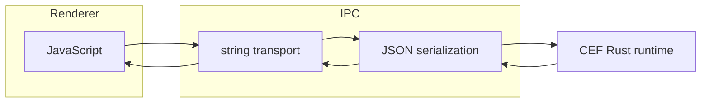
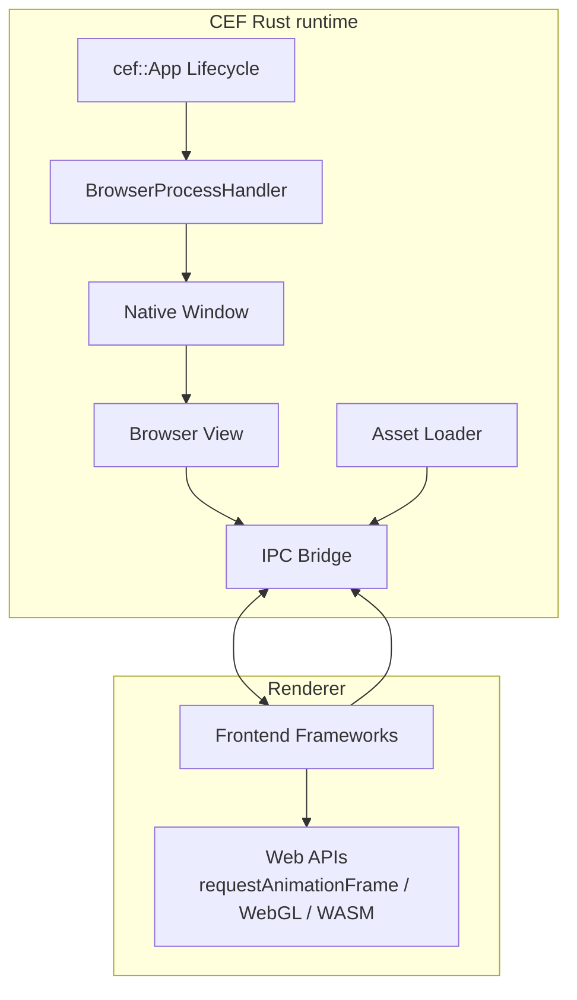

# Architecture

`rust-cef-runtime` is a compact Rust binding layer around CEF's native application model.

It does not emulate a browser: it hosts Chromium as a runtime component.

## Process model

CEF uses a multi-process architecture:

#### Browser process

* Window creation
* Navigation
* IPC dispatch

#### Renderer process

* JavaScript execution
* V8 contexts
* Promise resolution

#### GPU process

* Compositing
* Rasterization

#### Utility processes

* Networking / media

The same binary is launched in different roles.
Initialization must only occur in the browser process.

## Responsibilities

The runtime provides:

* Deterministic startup
* Window + browser creation
* Custom protocol handling
* Renderer ↔ browser messaging
* Asset resolution

It intentionally does not provide a UI framework.

## Custom protocol (`app://`)

All local assets are loaded through a CEF scheme handler.

Goals:

* Same-origin behavior
* CORS compatibility
* Dev server replacement
* No embedded HTTP server

## IPC model



Renderer cannot access native APIs directly.

Instead:

```
JS -> structured message -> browser process -> Rust handler -> response
```

This creates a capability-based boundary similar to a syscall interface.

See [docs/ipc.md](docs/ipc.md) for protocol details.

## Threading

CEF enforces thread affinity:

* UI thread -> browser logic
* IO thread -> resource loading
* Renderer thread -> V8 execution

The runtime avoids blocking these threads and delegates work to worker pools when needed.

## Non-goals

This project intentionally does not implement:

* DOM abstraction layer
* Widget toolkit
* Opinionated state management
* Bundled JS runtime

It is a platform foundation, not an application framework.

## Architecture overview



You explicitly control **everything**:

* Window creation
* Browser lifecycle
* Rendering backend
* IPC boundaries

There is no hidden runtime behavior.
