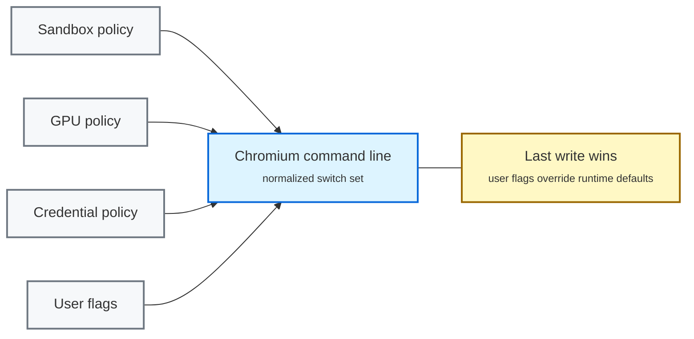
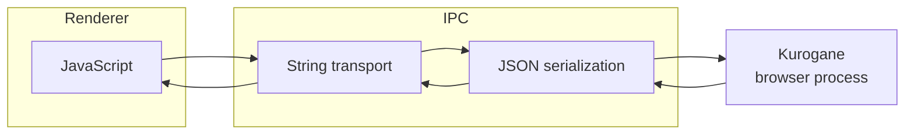
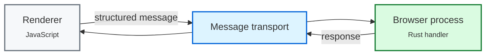
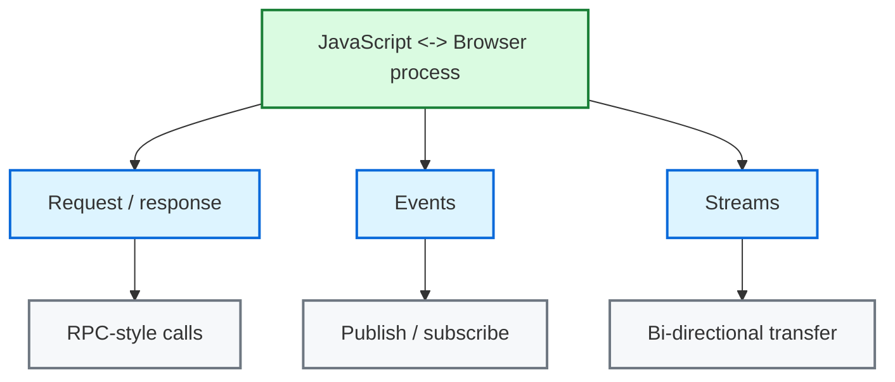
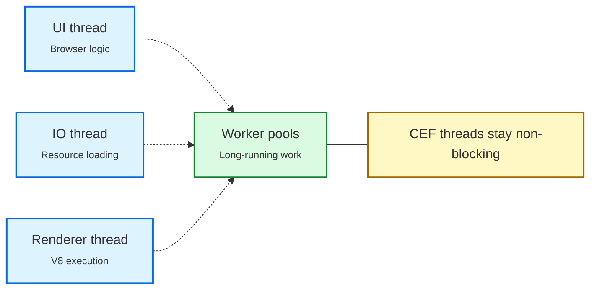
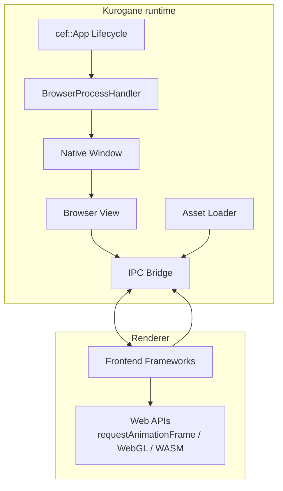

# Architecture

Kurogane is a compact Rust binding layer around Chromium's native application model.

It does not emulate a browser: it hosts Chromium as a runtime component.

## Overview

Kurogane's runtime model is organized around a small set of clear ownership boundaries.

### Runtime and event loop

The runtime can be initialized without entering Chromium's internal blocking message loop. Applications provide their own event loop and drive Chromium's message pump explicitly. This is the foundation for embedding Kurogane into existing GUI frameworks: [`winit`](docs/winit.md), raw OS window handles, or anything else that manages its own run loop.

### Runtime configuration

The runtime provides a minimal set of application-level controls for configuring Chromium behavior, GPU mode selection and startup flags. These are intentionally exposed at the application boundary so embedding applications can adjust runtime behavior without coupling to internal implementation details.

### Browser and window ownership

Browsers and windows are independently tracked entities with separate lifetimes. The runtime maintains a browser/window ownership graph with O(1) lookup, explicit popup ownership derived from opener browsers and DevTools browsers classified separately from application windows. Runtime shutdown is tied to browser lifetime, not window destruction. DevTools windows and auxiliary popups do not inadvertently tear down the application.

### Browser lifecycle

Browser creation returns a browser handle. Close routing follows Chromium's expected browser shutdown protocol, including closing-state tracking, reentrancy protection and deterministic destruction sequencing. [`on_before_close`](https://magpcss.org/ceforum/apidocs3/projects/(default)/CefLifeSpanHandler.html#OnBeforeClose) fires reliably and shutdown signals propagate in a controlled and predictable order.

### Request/response IPC (RPC-style)

Kurogane provides IPC as a direct Rust-to-Chromium communication bridge designed for high-throughput interaction between runtime and renderer processes. Messages are structured and low-overhead, designed for high-frequency interaction between runtime and frontend. Large payloads are routed through a zero-copy transfer path instead of serialized IPC, allowing efficient exchange of binary data without additional runtime layers.

### Runtime extensibility

Applications can participate in browser process initialization and renderer process lifecycle without replacing Kurogane's default infrastructure. This includes custom command-line processing, V8 context lifecycle hooks, JavaScript exception handling, process message routing and more.

## Workspace

Three crates with distinct responsibilities:

| Crate | Responsibility |
|-------|----------------|
| `kurogane` | The runtime. Process model, browser and window lifecycle, IPC, asset resolution. |
| `kurogane-layout` | Filesystem knowledge. Chromium discovery, provenance, validation, runtime materialization and bundle layouts. |
| `kurogane-cli` | Developer tooling. `init`, `dev`, `run`, `bundle`, `doctor`, `info`, `install`. |

The runtime and CLI are separate layers: the runtime does not depend on the CLI and the CLI interacts with the runtime through its public interfaces.

## Process model

Chromium uses a multi-process architecture:

#### Browser process

* Window creation
* Navigation
* IPC dispatch

#### Renderer process

* JavaScript execution
* V8 contexts
* Promise resolution

#### GPU process

* Compositing
* Rasterization

#### Utility processes

* Networking / media

The same binary is launched in different process roles. Non-browser processes exit from the application entry point. Kurogane initializes the runtime only in the browser process.

## Responsibilities

The runtime provides:

* Deterministic startup
* Window + browser creation
* Custom protocol handling
* Renderer <-> browser messaging
* Asset resolution

It does not provide a UI framework; the frontend remains the application's responsibility.

## Runtime layout

Chromium is resolved before initialization in a fixed order: `CEF_PATH`, a runtime bundled next to the executable, then the managed installation.

The CLI and runtime use the same resolution logic, so `kurogane dev` and the application use the same Chromium installation.

The runtime follows each platform's native distribution layout rather than trying to normalize them into a single structure.

On macOS, the framework is self-contained, so Chromium resolves its resources and locales from the framework bundle.

Packaging follows the same split: each platform has its own bundle layout rather than a shared one.

## Platform initialization

Linux and Windows need no application-level setup. Chromium is initialized directly.

macOS requires a little more setup. AppKit expects an `NSApplication` subclass conforming to Chromium's `CrAppProtocol` before any browser is created, so the runtime provides that integration, loads the framework from its absolute path and attaches the application delegate.

Cocoa's default `terminate:` calls `exit()`, which bypasses the run loop Chromium relies on for orderly shutdown. Kurogane instead closes the browsers and lets the last browser close end the message loop.

## Startup policy

Chromium's command line is assembled once in the browser process from a small set of runtime policies plus user overrides. Each policy contributes switches independently to a normalized switch set with last-write-wins precedence. User-supplied flags are applied last, so they can override runtime defaults.

Chromium's command line is assembled once in the browser process from a small set of runtime policies plus user overrides:

```mermaid
flowchart LR
    A["Sandbox policy"]
    B["GPU policy"]
    C["Credential policy"]
    D["User flags"]

    E["Chromium command line<br/><span style='font-size:12px'>normalized switch set</span>"]

    A --> E
    B --> E
    C --> E
    D --> E

    N["Last write wins<br/><span style='font-size:12px'>user flags override runtime defaults</span>"]

    E --- N

    classDef policy fill:#f6f8fa,stroke:#6e7781,stroke-width:2px;
    classDef command fill:#ddf4ff,stroke:#0969da,stroke-width:2px;
    classDef note fill:#fff8c5,stroke:#9a6700,stroke-width:2px;

    class A,B,C,D policy;
    class E command;
    class N note;
```

* **Sandbox**: Process privilege isolation.
* **GPU**: Backend selection (`GpuMode`) based on the detected environment.
* **Credentials**: Whether cookies and passwords are stored in the platform credential store (`CredentialStorage`).

## Browser and window ownership

Browsers and windows are tracked as separate entities with separate lifetimes.

The runtime maintains an ownership graph with O(1) lookup, derives popup ownership from opener browsers and classifies DevTools browsers separately from application windows.

Shutdown follows browser lifetime rather than individual window destruction, so DevTools and auxiliary popups do not tear down the application.

## Custom protocol (`app://`)

Local assets are served through a Chromium scheme handler under `app://`.

Goals:

* Same-origin behavior
* CORS compatibility
* Dev server replacement
* No embedded HTTP server

## IPC model

```mermaid
flowchart LR
    subgraph Renderer
        JS[JavaScript]
    end

    subgraph IPC
        STR[String transport]
        JSON[JSON serialization]
    end

    K["Kurogane<br/>browser process"]

    JS --> STR
    STR --> JSON
    JSON --> K

    K --> JSON
    JSON --> STR
    STR --> JS
```

Renderer code cannot access native APIs directly. Native access goes through a clear message boundary between JavaScript and the browser process. JavaScript only gets access to the native operations that the application explicitly exposes.

```mermaid
flowchart LR
    A["Renderer<br/><span style='font-size:12px'>JavaScript</span>"]
    B["Message transport"]
    C["Browser process<br/><span style='font-size:12px'>Rust handler</span>"]

    A -->|structured message| B
    B --> C
    C -->|response| B
    B --> A

    classDef renderer fill:#f6f8fa,stroke:#6e7781,stroke-width:2px;
    classDef transport fill:#ddf4ff,stroke:#0969da,stroke-width:2px;
    classDef browser fill:#dafbe1,stroke:#1a7f37,stroke-width:2px;

    class A renderer;
    class B transport;
    class C browser;
```

Three subsystems share that boundary:

```mermaid
flowchart TD
    A["JavaScript <-> Browser process"]

    A --> B["Request / response"]
    A --> C["Events"]
    A --> D["Streams"]

    B --> B1["RPC-style calls"]
    C --> C1["Publish / subscribe"]
    D --> D1["Bi-directional transfer"]

    classDef root fill:#dafbe1,stroke:#1a7f37,stroke-width:2px;
    classDef mode fill:#ddf4ff,stroke:#0969da,stroke-width:2px;
    classDef detail fill:#f6f8fa,stroke:#6e7781,stroke-width:2px;

    class A root;
    class B,C,D mode;
    class B1,C1,D1 detail;
```

* **Request/response**: RPC-style calls resolving to a JS promise.
* **Events**: Publish/subscribe delivery to subscribed frames.
* **Streams**: Bi-directional transfers identified by stream ID, with per-stream handlers and state.

Small payloads use JSON over Chromium's string transport. Large binary payloads use Kurogane's purpose-built shared-memory transport instead, avoiding serialization and an extra copy across the boundary.

See [exposing Rust commands to JavaScript](docs/recipes.md#exposing-rust-commands-to-javascript) for usage.

## Threading

Chromium enforces thread affinity:

| Thread   | Owns             |
| -------- | ---------------- |
| UI       | Browser logic    |
| IO       | Resource loading |
| Renderer | V8 execution     |

Kurogane keeps these threads non-blocking and moves longer-running work to worker pools when needed.

```mermaid
flowchart LR
    A["UI thread<br/><span style='font-size:12px'>Browser logic</span>"]
    B["IO thread<br/><span style='font-size:12px'>Resource loading</span>"]
    C["Renderer thread<br/><span style='font-size:12px'>V8 execution</span>"]

    D["Worker pools<br/><span style='font-size:12px'>Long-running work</span>"]

    A -.-> D
    B -.-> D
    C -.-> D

    N["CEF threads stay non-blocking"]

    D --- N

    classDef thread fill:#ddf4ff,stroke:#0969da,stroke-width:2px;
    classDef worker fill:#dafbe1,stroke:#1a7f37,stroke-width:2px;
    classDef note fill:#fff8c5,stroke:#9a6700,stroke-width:2px;

    class A,B,C thread;
    class D worker;
    class N note;
```

## Embedding

The runtime can be initialized without entering Chromium's blocking message loop.

In embedded mode, the host owns the event loop and window hierarchy and drives Chromium's message pump explicitly. Chromium creates no window of its own, and Kurogane installs no signal handling.

This makes it possible to embed Kurogane into `winit`, raw OS window handles, or an existing GUI framework.

Applications can also participate in browser and renderer process startup through delegates, command-line processing, V8 context lifecycle, JavaScript exception handling and process message routing, without replacing Kurogane's own infrastructure.

## Non-goals

This project intentionally does not implement:

* DOM abstraction layer
* Widget toolkit
* Opinionated state management
* Bundled JS runtime

Kurogane is a platform foundation, not an application framework.

## Architecture overview

```mermaid
flowchart TB
    %% Kurogane Layer
    subgraph Kurogane["Kurogane runtime"]
        A[cef::App Lifecycle]
        B[BrowserProcessHandler]
        C[Native Window]
        D[Browser View]
        E[Asset Loader]
        F[IPC Bridge]
    end

    %% Renderer Layer
    subgraph Renderer["Renderer"]
        G[Frontend Frameworks]
        H[Web APIs<br/>requestAnimationFrame / WebGL / WASM]
    end

    %% Internal Rust connections
    A --> B
    B --> C
    C --> D
    D --> F
    E --> F

    %% Renderer connections
    G --> H
    G --> F

    %% IPC Bridge connection
    F <--> G
```

Kurogane leaves the application in control of the key integration points:

* Window creation
* Browser lifecycle
* Rendering backend
* IPC boundaries

Kurogane does not impose another application framework on top of those pieces.
