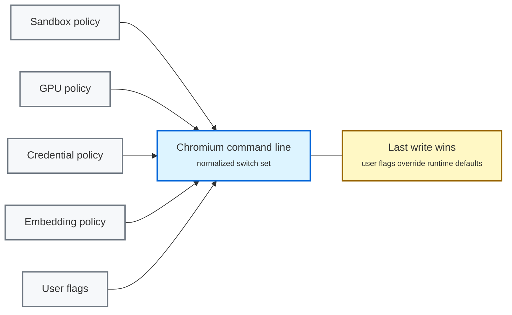
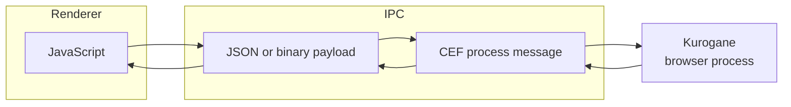
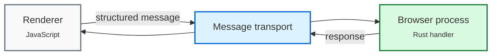
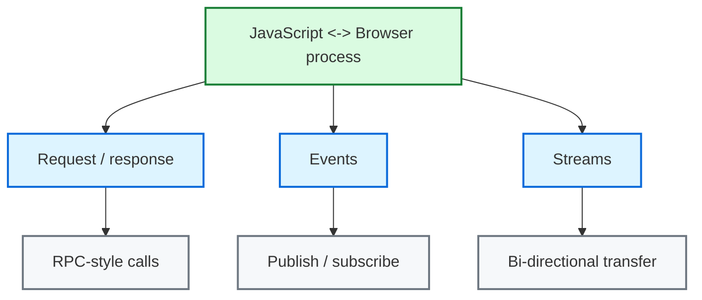
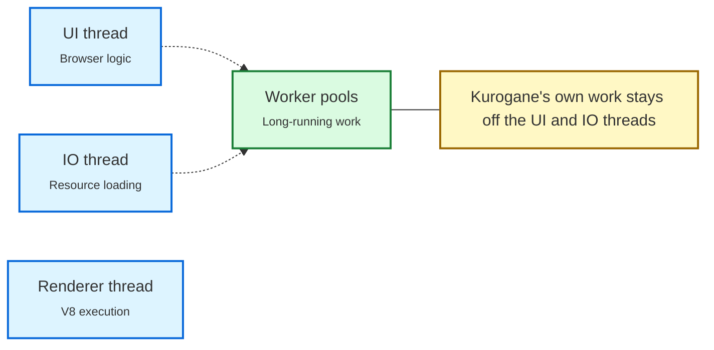
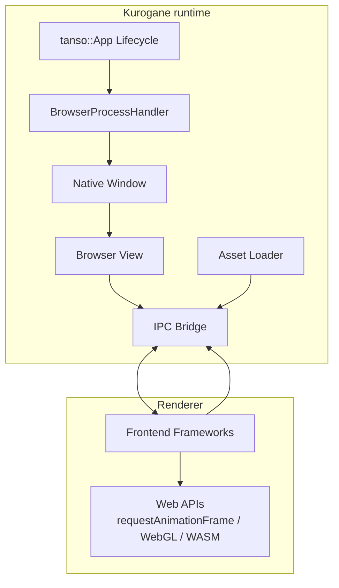

# Architecture

Kurogane is a compact Rust binding layer around Chromium's native application model.

It does not emulate a browser. It hosts Chromium as a runtime component.

## Overview

Kurogane's runtime model is organized around a small set of clear ownership boundaries.

### Runtime and event loop

The runtime can start without entering Chromium's internal blocking message loop. Applications provide their own event loop and drive Chromium's message pump themselves. That is the foundation for embedding Kurogane into existing GUI frameworks ([`winit`](docs/winit.md), raw OS window handles or anything else that runs its own loop).

### Runtime configuration

The runtime provides a small set of application-level controls for Chromium's behavior, GPU mode and startup flags. They sit at the application boundary on purpose. Embedding applications adjust runtime behavior without coupling to internal implementation details.

### Browser and window ownership

Browsers and windows are tracked separately with separate lifetimes. The runtime keeps a browser and window ownership graph with O(1) lookup. Popup ownership comes from opener browsers. DevTools browsers are classified apart from application windows. Shutdown is tied to browser lifetime and not window destruction. DevTools windows and auxiliary popups never tear down the application by accident.

### Browser lifecycle

Browser creation returns a browser handle. Close routing follows CEF's close protocol. A window asks its browser to close through `TryCloseBrowser`. Page unload handlers can cancel the close. A browser counts as closed only after [`on_before_close`](https://magpcss.org/ceforum/apidocs3/projects/(default)/CefLifeSpanHandler.html#OnBeforeClose) runs for it. Shutdown signals propagate in a controlled and predictable order.

### Request/response IPC (RPC-style)

Kurogane provides IPC as a direct bridge between Rust and Chromium built for high-throughput interaction between the runtime and renderer processes. Messages are structured and low-overhead. Large payloads travel through shared memory instead of serialized IPC. Both sides read a payload in place. The exception is a renderer in Chromium's sandbox. There the browser copies the renderer's payload out once on arrival because a compromised renderer could keep writing its side of the region. An unsandboxed renderer already has the user's rights and the copy would protect nothing.

### Runtime extensibility

Applications can take part in browser process initialization and renderer process lifecycle without replacing Kurogane's own infrastructure. That includes custom command-line processing, V8 context lifecycle hooks, JavaScript exception handling, process message routing and more.

## Workspace

Five crates with distinct responsibilities:

| Crate | Responsibility |
|-------|----------------|
| `kurogane` | The runtime. Process model, browser and window lifecycle, IPC, access control, capabilities and asset resolution. |
| `kurogane-layout` | The contract a bundle and the runtime share. Where a bundle keeps its Chromium runtime, resources and macOS helper, what makes a runtime complete and where application profiles live. |
| `kurogane-cli` | Developer tooling. `new`, `init`, `install`, `dev`, `run`, `bundle`, `clean`, `showcase`, `doctor`, `list`, `info` and `self uninstall`. Bundle layouts, packaging and the provenance check of the runtime a bundle carries. |
| `kurogane-build` | Build-time setup. An application's `build.rs` calls `kurogane_build::build()` to embed the Windows application manifest CEF's own executables carry. |
| `kurogane-suite` | Test scenarios and the `winit` examples, each an example of the crate. Not published. |

CEF's Rust bindings are tanso. It is a separate project. The runtime builds on `tanso` and re-exports it as `kurogane::tanso`. The CLI installs CEF through `tanso-download`. `kurogane-build` calls `tanso-build`.

The runtime and CLI are separate layers. Neither depends on the other; both depend on `kurogane-layout`. That is the contract they share.

## Process model

Chromium uses a multi-process architecture:

#### Browser process

* Window creation
* Navigation
* IPC dispatch

#### Renderer process

* JavaScript execution
* V8 contexts
* Promise resolution

#### GPU process

* Compositing
* Rasterization

#### Utility processes

* Networking and media

The same binary is launched in different process roles. Processes other than the browser exit from the application entry point. Kurogane starts the runtime only in the browser process.

## Responsibilities

The runtime provides:

* Startup in a fixed order
* Window and browser creation
* Custom protocol handling
* Renderer <-> browser messaging
* Per-origin access control and capabilities
* Asset resolution

It does not provide a UI framework; the frontend remains the application's responsibility.

## Runtime layout

An application finds its Chromium the same way however it is started. The CLI follows the same rule:

* An application in a bundle runs the runtime inside its bundle and no other. It uses neither `CEF_PATH` nor the installation and loads its resources and locales from the tree its libcef came from. `kurogane bundle` marks a bundle with a `kurogane-bundle` file beside the executable (a macOS `.app` needs none). An application whose bundle has lost its runtime reports the bundle incomplete.
* Any other application loads the runtime tanso finds (`tanso::sys::find_cef_dir`). That is a runtime beside its executable, else the one `CEF_PATH` names, else tanso's shared installation of the CEF version the application was built against. A `CEF_PATH` naming no directory is an error and never skipped. A plain `cargo run` and `kurogane run` start the application the same way.
* Loading refuses a libcef that is not the CEF build the application was built against.
* `kurogane install`, `dev`, `run` and `bundle` install the CEF version the project's application loads when it is missing. They read that version from the project's tanso-sys. `dev` and `run` pass the application nothing.
* `kurogane bundle` copies into the bundle the runtime `CEF_PATH` names, else the installation; either needs verified provenance ([Chromium resolution](docs/bundling.md#chromium-resolution)). That is the only use of either. Once bundled the application never looks outside its bundle.

`kurogane doctor` reports the runtime the application loads and the one `bundle` would package.

The runtime follows each platform's native distribution layout and does not normalize them into one structure.

On macOS the framework is self-contained. Chromium resolves its resources and locales from the framework bundle.

Packaging follows the same split. Each platform has its own bundle layout.

## Platform initialization

Linux and Windows need no application-level setup. Chromium is initialized directly.

Windows uses a different launch model for Chromium's sandbox. The process that starts the browser acts as its broker. CEF provides a bootstrap executable for that role. A sandboxed application runs through the bootstrap and does not start its own executable directly.

The rest of the process model stays the same. CEF helpers start through the same application entry point. The runtime passes the sandbox state from the bootstrap into CEF.

macOS needs a little more setup. AppKit expects an `NSApplication` subclass that conforms to Chromium's `CrAppProtocol` before any browser is created. The runtime provides that integration, loads the framework from its absolute path and attaches the application delegate. It also installs the standard App, Edit and Window menus.

Cocoa's default `terminate:` calls `exit()`. That bypasses the run loop Chromium relies on for orderly shutdown. Kurogane closes the browsers instead and lets the last browser's close end the message loop.

## Startup policy

Chromium's command line is assembled once in the browser process from a small set of runtime policies and user overrides. Each policy adds switches to a normalized switch set with last-write-wins precedence. User-supplied flags apply last and override runtime defaults. The feature lists `enable-features` and `disable-features` are merged instead and keep every entry.

```mermaid
flowchart LR
    A["Sandbox policy"]
    B["GPU policy"]
    C["Credential policy"]
    F["Embedding policy"]
    D["User flags"]

    E["Chromium command line<br/><span style='font-size:12px'>normalized switch set</span>"]

    A --> E
    B --> E
    C --> E
    F --> E
    D --> E

    N["Last write wins<br/><span style='font-size:12px'>user flags override runtime defaults</span>"]

    E --- N

    classDef policy fill:#f6f8fa,stroke:#6e7781,stroke-width:2px;
    classDef command fill:#ddf4ff,stroke:#0969da,stroke-width:2px;
    classDef note fill:#fff8c5,stroke:#9a6700,stroke-width:2px;

    class A,B,C,F,D policy;
    class E command;
    class N note;
```

* **Sandbox:** Process isolation from the host system. Each platform has requirements the runtime checks before CEF starts. A requested sandbox either starts with those protections or the launch fails.
* **GPU:** Backend selection (`GpuMode`) for the detected environment.
* **Credentials:** Whether cookies and passwords are stored in the platform credential store (`CredentialStorage`).
* **Embedding:** On Linux an embedded application runs Chromium on X11. CEF parents a browser only to an X11 window there.

## Browser and window ownership

Browsers and windows are tracked as separate entities with separate lifetimes.

The runtime keeps an ownership graph with O(1) lookup. It derives popup ownership from opener browsers and classifies DevTools browsers apart from application windows.

An application window (the start window and every `create_window`) is placed before it exists from its `WindowOptions`. It opens at its bounds, moves onto a display when none shows them or centers at its size on the primary display. Its title is the one its options set or else its page's. A display handler follows the page's title. Popups follow their page's title too.

Shutdown follows browser lifetime and not the destruction of individual windows. DevTools and auxiliary popups do not tear down the application. The last browser's close ends the application. `should_shutdown` turns true. When `AppInstance::run` is in CEF's message loop Kurogane asks CEF to end that loop. Kurogane quits no loop it did not start. A closed browser leaves its window's link at once even when CEF destroys the window later.

The graph sits behind one lock. Only the UI thread changes it. Any thread may read it through `AppHandle`. Kurogane lets go of the lock before any CEF call that can call back into it (creating or closing a browser or a window for example). CEF may run those callbacks on the same thread before the call returns.

A page cannot give itself a window. Kurogane asks the application's `on_new_window` hook before CEF creates a popup or opens a link clicked into a new tab. Then it applies its own policy. A page of the application's own origin gets a window. A web link the user clicked goes to the system browser. Anything else is refused. Chromium's own tabbed browser window never opens.

A page cannot take its window anywhere either. Each browser keeps the origins let into it. Those are the origins the application loaded there itself, the origin `on_new_window` opened a popup to and the origins the `on_navigation` hook allowed. CEF marks the application's own loads and the redirects they lead to with a flag a page cannot set. A page navigates freely within those origins and the application's own; anywhere else the hook and Kurogane's policy decide as for a new window.

Chromium's commands pass Kurogane's allowlist first (page-local commands only). Then the application's `on_chrome_command` hook may refuse what the allowlist lets run. It can never run what the allowlist refuses. Keys reach the `on_key` hook before Chromium turns them into commands. A key press the hook consumes never becomes a command. One it gives the page first becomes a command only when the page lets it through.

A page cannot write to the disk on its own. Every download stops at Kurogane's download handler before a byte is saved. The application's `on_download` hook may name the file's place, ask the user or refuse. Without an answer the user is asked with the system's Save As dialog. A window shows one dialog at a time. Kurogane answers Chromium's prompt for several downloads and it never shows. Chromium's bubble of finished downloads is turned off.

A page cannot use a device or a sensitive feature on its own either. Permission requests are denied unless `on_permission` allows them. Right-clicks open Kurogane's own menu. `on_context_menu` edits it. File choosers, drags into embedded browsers, title changes, fullscreen changes, window closes and a second launch each reach a hook of their own.

Application hooks follow one convention. Each takes a typed request and the `AppHandle`. Each runs on the UI thread with no lock held. Each answers with a decision whose `Default` leaves the choice to Kurogane. A hook that panics gets the safe answer and never unwinds into CEF. The startup spec owns the hooks. The runtime state every `AppHandle` shares only points to them. A hook that keeps a handle creates no cycle because CEF releases the spec at shutdown.

## Custom protocol (`app://`)

Local assets are served through a Chromium scheme handler under `app://`. The handler only records the request on CEF's IO thread. The file is resolved and read on a worker thread when CEF opens the response.

Goals:

* Same-origin behavior
* CORS compatibility
* Dev server replacement
* No embedded HTTP server

## IPC model

```mermaid
flowchart LR
    subgraph Renderer
        JS[JavaScript]
    end

    subgraph IPC
        JSON[JSON or binary payload]
        MSG[CEF process message]
    end

    K["Kurogane<br/>browser process"]

    JS --> JSON
    JSON --> MSG
    MSG --> K

    K --> MSG
    MSG --> JSON
    JSON --> JS
```

Renderer code cannot reach native APIs directly. Native access goes through a clear message boundary between JavaScript and the browser process. JavaScript reaches only the native operations the application exposes.

```mermaid
flowchart LR
    A["Renderer<br/><span style='font-size:12px'>JavaScript</span>"]
    B["Message transport"]
    C["Browser process<br/><span style='font-size:12px'>Rust handler</span>"]

    A -->|structured message| B
    B --> C
    C -->|response| B
    B --> A

    classDef renderer fill:#f6f8fa,stroke:#6e7781,stroke-width:2px;
    classDef transport fill:#ddf4ff,stroke:#0969da,stroke-width:2px;
    classDef browser fill:#dafbe1,stroke:#1a7f37,stroke-width:2px;

    class A renderer;
    class B transport;
    class C browser;
```

Three subsystems share that boundary:

```mermaid
flowchart TD
    A["JavaScript <-> Browser process"]

    A --> B["Request / response"]
    A --> C["Events"]
    A --> D["Streams"]

    B --> B1["RPC-style calls"]
    C --> C1["Publish / subscribe"]
    D --> D1["Bi-directional transfer"]

    classDef root fill:#dafbe1,stroke:#1a7f37,stroke-width:2px;
    classDef mode fill:#ddf4ff,stroke:#0969da,stroke-width:2px;
    classDef detail fill:#f6f8fa,stroke:#6e7781,stroke-width:2px;

    class A root;
    class B,C,D mode;
    class B1,C1,D1 detail;
```

* **Request/response:** RPC-style calls resolving to a JS promise.
* **Events:** Publish and subscribe delivery to subscribed frames.
* **Streams:** Bi-directional transfers identified by stream ID with per-stream handlers and state. A handler accepts or refuses the open before the page holds the stream; the first end or error sent closes it. An end the page sends is always answered.

JavaScript values travel as JSON and binary data as raw bytes. Each travels behind a small binary envelope in a CEF process message. Smaller messages travel inline in the process message's argument list. A larger one travels in shared memory. That avoids serialization and an extra copy across the boundary. A very large payload for the page is copied into its `ArrayBuffer` on a thread of its own. The page's main thread stays free during a big transfer. A frame's messages still arrive in the order sent.

See [exposing Rust commands to JavaScript](docs/recipes.md#exposing-rust-commands-to-javascript) and [streaming data](docs/recipes.md#streaming-data) for usage.

### Access control

Every command, event subscription and stream is checked against the calling page's origin before it runs. By default only the application's own origin passes. `App::permit` and its relatives open a name to other origins. `App::deny_unlisted` closes every name without a rule. A sandboxed frame has an opaque origin and matches no rule. See [Who may call a command](docs/recipes.md#who-may-call-a-command).

### Capabilities

Native resources beyond the application's own commands are capabilities. The filesystem is the first. A page reaches files through `window.kurogane.fs` only within the grants its origin holds. A grant names an origin, a scope of allowed and denied paths and the operations allowed there. Paths resolve beneath their root without following links. Deny rules always win. A denied request never reveals what was asked for. Grants bind pages only and never the application's own Rust code. See [The filesystem capability](docs/recipes.md#the-filesystem-capability).

## Threading

Chromium ties its work to threads:

| Thread   | Owns             |
| -------- | ---------------- |
| UI       | Browser logic    |
| IO       | Resource loading |
| Renderer | V8 execution     |

Kurogane reads `app://` files on a CEF worker thread. It runs `fs.*` operations on a worker thread of its own. A request fails when that thread cannot start. Neither holds up the UI or IO thread. In each renderer it fills very large `ArrayBuffers` on a thread of its own.

The application's handlers run on the UI thread. That covers commands (the body of an async command included), stream factories, stream handlers and the second-instance hook. Every window waits until one returns. Slow work belongs on a thread of the application's own; any thread may resolve a `Responder` or use a `StreamResponder`.

```mermaid
flowchart LR
    A["UI thread<br/><span style='font-size:12px'>Browser logic</span>"]
    B["IO thread<br/><span style='font-size:12px'>Resource loading</span>"]
    C["Renderer thread<br/><span style='font-size:12px'>V8 execution</span>"]

    D["Worker pools<br/><span style='font-size:12px'>Long-running work</span>"]

    A -.-> D
    B -.-> D

    N["Kurogane's own work stays off the UI and IO threads"]

    D --- N

    classDef thread fill:#ddf4ff,stroke:#0969da,stroke-width:2px;
    classDef worker fill:#dafbe1,stroke:#1a7f37,stroke-width:2px;
    classDef note fill:#fff8c5,stroke:#9a6700,stroke-width:2px;

    class A,B,C thread;
    class D worker;
    class N note;
```

`AppHandle` and `BrowserHandle` work from any thread as CEF allows for browsers in the browser process. The exceptions are `BrowserHandle::set_bounds` and `BrowserHandle::has_devtools`. They run only on the UI thread and panic elsewhere.

`AppHandle`'s closing and ending run on the UI thread. They run at once when asked there and are posted there otherwise. CEF's cefsimple sample closes its browsers the same way.

`AppHandle` and `BrowserHandle` calls that would reach CEF do nothing once `AppInstance::shutdown` has begun. CEF takes no call after `CefShutdown`. A call on another thread at that very moment can still reach CEF. An application stops using its handles on other threads before it shuts CEF down.

CEF calls into Kurogane through the `extern "C"` trampolines tanso generates. They do not catch panics. A panic that reaches one aborts the process it runs in. In the browser process that ends the application. In a renderer it ends that renderer. Kurogane's own callbacks never unwrap a value CEF may leave out.

Kurogane catches a panic in the application code it runs to answer a page's request:

* A command handler (the request rejects)
* A stream factory or stream handler (the stream errors)
* `SchemeHandler::create` (the request fails as it does for `None`)

A panic in any other application code aborts. That includes callbacks that see page data (renderer delegates, the application's own `ResourceHandler` and a delegate's `LoadHandler`). The entry points `sandbox_entry!` exports for CEF's Windows bootstrap catch a panic in the application's `main` and return exit code 1. This holds with Rust's default `panic = "unwind"`. An application built with `panic = "abort"` ends at any panic.

## Embedding

The runtime can start without entering Chromium's blocking message loop.

In embedded mode the host owns the event loop and window hierarchy and drives Chromium's message pump. Each browser draws into a child window Chromium makes inside the host's window. Closing the browser destroys that child window and leaves the host's window open. Kurogane installs no signal handling.

That makes it possible to embed Kurogane into `winit`, raw OS window handles or an existing GUI framework.

Applications can also take part in browser and renderer process startup through delegates. That covers command-line processing, V8 context lifecycle, JavaScript exception handling and process message routing. None of it replaces Kurogane's own infrastructure.

## Non-goals

This project does not implement:

* A DOM abstraction layer
* A widget toolkit
* Opinionated state management
* A bundled JS runtime

Kurogane is a platform foundation and not an application framework.

## Architecture overview

```mermaid
flowchart TB
    %% Kurogane Layer
    subgraph Kurogane["Kurogane runtime"]
        A[tanso::App Lifecycle]
        B[BrowserProcessHandler]
        C[Native Window]
        D[Browser View]
        E[Asset Loader]
        F[IPC Bridge]
    end

    %% Renderer Layer
    subgraph Renderer["Renderer"]
        G[Frontend Frameworks]
        H[Web APIs<br/>requestAnimationFrame / WebGL / WASM]
    end

    %% Internal Rust connections
    A --> B
    B --> C
    C --> D
    D --> F
    E --> F

    %% Renderer connections
    G --> H
    G --> F

    %% IPC Bridge connection
    F <--> G
```

Kurogane leaves the application in control of the key integration points:

* Window creation
* Browser lifecycle
* Rendering backend
* IPC boundaries

Kurogane does not impose another application framework on top of those pieces.
