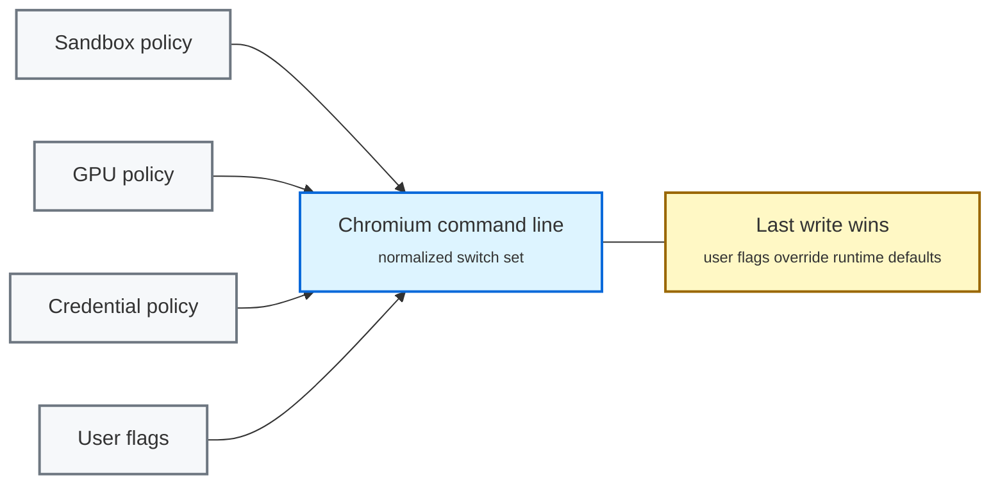
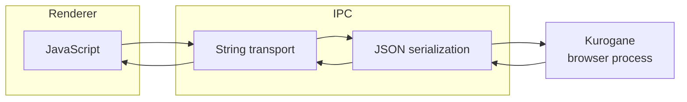
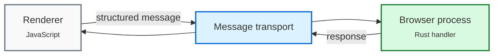
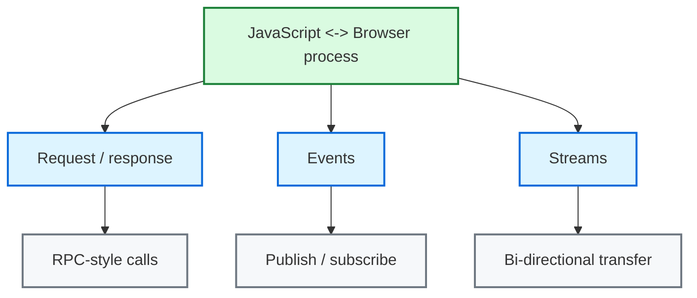
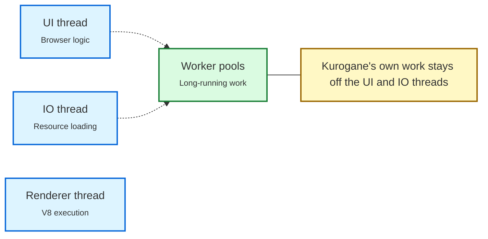
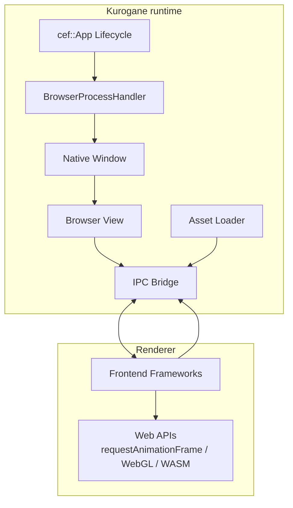

# Architecture

Kurogane is a compact Rust binding layer around Chromium's native application model.

It does not emulate a browser: it hosts Chromium as a runtime component.

## Overview

Kurogane's runtime model is organized around a small set of clear ownership boundaries.

### Runtime and event loop

The runtime can be initialized without entering Chromium's internal blocking message loop. Applications provide their own event loop and drive Chromium's message pump explicitly. This is the foundation for embedding Kurogane into existing GUI frameworks: [`winit`](docs/winit.md), raw OS window handles, or anything else that manages its own run loop.

### Runtime configuration

The runtime provides a minimal set of application-level controls for configuring Chromium behavior, GPU mode selection and startup flags. These are intentionally exposed at the application boundary so embedding applications can adjust runtime behavior without coupling to internal implementation details.

### Browser and window ownership

Browsers and windows are independently tracked entities with separate lifetimes. The runtime maintains a browser/window ownership graph with O(1) lookup, explicit popup ownership derived from opener browsers and DevTools browsers classified separately from application windows. Runtime shutdown is tied to browser lifetime, not window destruction. DevTools windows and auxiliary popups do not inadvertently tear down the application.

### Browser lifecycle

Browser creation returns a browser handle. Close routing follows CEF's close protocol. A window asks its browser to close through `TryCloseBrowser`. Page unload handlers can cancel the close. A browser is considered closed only after [`on_before_close`](https://magpcss.org/ceforum/apidocs3/projects/(default)/CefLifeSpanHandler.html#OnBeforeClose) runs for it. Shutdown signals propagate in a controlled and predictable order.

### Request/response IPC (RPC-style)

Kurogane provides IPC as a direct Rust-to-Chromium communication bridge designed for high-throughput interaction between runtime and renderer processes. Messages are structured and low-overhead, designed for high-frequency interaction between runtime and frontend. Large payloads travel through shared memory instead of serialized IPC, allowing efficient exchange of binary data without additional runtime layers. Both sides read a payload in place, except when renderers run in Chromium's sandbox: then the browser copies a renderer's payload out once, on arrival, since a compromised renderer could keep writing its side of the region. Unsandboxed, such a renderer already has the user's rights, and the copy would protect nothing.

### Runtime extensibility

Applications can participate in browser process initialization and renderer process lifecycle without replacing Kurogane's default infrastructure. This includes custom command-line processing, V8 context lifecycle hooks, JavaScript exception handling, process message routing and more.

## Workspace

Three crates with distinct responsibilities:

| Crate | Responsibility |
|-------|----------------|
| `kurogane` | The runtime. Process model, browser and window lifecycle, IPC, asset resolution. |
| `kurogane-layout` | Filesystem knowledge. Chromium discovery, provenance, validation, runtime materialization and bundle layouts. |
| `kurogane-cli` | Developer tooling. `init`, `dev`, `run`, `bundle`, `doctor`, `info`, `install`. |

The runtime and CLI are separate layers: the runtime does not depend on the CLI and the CLI interacts with the runtime through its public interfaces.

## Process model

Chromium uses a multi-process architecture:

#### Browser process

* Window creation
* Navigation
* IPC dispatch

#### Renderer process

* JavaScript execution
* V8 contexts
* Promise resolution

#### GPU process

* Compositing
* Rasterization

#### Utility processes

* Networking / media

The same binary is launched in different process roles. Non-browser processes exit from the application entry point. Kurogane initializes the runtime only in the browser process.

## Responsibilities

The runtime provides:

* Deterministic startup
* Window + browser creation
* Custom protocol handling
* Renderer <-> browser messaging
* Asset resolution

It does not provide a UI framework; the frontend remains the application's responsibility.

## Runtime layout

Each command has its own rule for which Chromium it uses, and all of them read `CEF_PATH` in one place (`kurogane_layout::cef_override`):

* An application in a bundle runs the runtime inside its bundle and no other: neither `CEF_PATH` nor the managed installation, so it loads its resources and locales from the tree its libcef came from. `kurogane bundle` marks a bundle with a `kurogane-bundle` file beside the executable (a macOS `.app` needs none), and an application whose bundle has lost its runtime reports the bundle incomplete.
* Any other application, frontendless or not, uses a runtime beside its executable, else the one `CEF_PATH` names.
* `kurogane dev`, `run` and `build` use `CEF_PATH`, else the managed installation (installing it when missing), and start the application with `CEF_PATH` pointing at that choice. So in development the application uses the Chromium the CLI chose.
* `kurogane bundle` copies into the bundle the runtime `CEF_PATH` names, else the managed installation, and requires verified provenance for either ([Chromium resolution](docs/bundling.md#chromium-resolution)). That is the only use of either: once bundled, the application never looks outside its bundle.

`kurogane doctor` reports the first choice of `dev` and the one `bundle` would package.

The runtime follows each platform's native distribution layout rather than trying to normalize them into a single structure.

On macOS, the framework is self-contained, so Chromium resolves its resources and locales from the framework bundle.

Packaging follows the same split: each platform has its own bundle layout rather than a shared one.

## Platform initialization

Linux and Windows need no application-level setup. Chromium is initialized directly.

Windows uses a different launch model for Chromium's sandbox. The process that starts the browser acts as its broker and CEF provides a bootstrap executable for that role. A sandboxed application therefore runs through the bootstrap rather than starting its application executable directly.

The rest of the process model stays the same. CEF helpers start through the same application entry point and the runtime passes the sandbox state from the bootstrap into CEF.

macOS requires a little more setup. AppKit expects an `NSApplication` subclass conforming to Chromium's `CrAppProtocol` before any browser is created, so the runtime provides that integration, loads the framework from its absolute path and attaches the application delegate.

Cocoa's default `terminate:` calls `exit()`, which bypasses the run loop Chromium relies on for orderly shutdown. Kurogane instead closes the browsers and lets the last browser close end the message loop.

## Startup policy

Chromium's command line is assembled once in the browser process from a small set of runtime policies plus user overrides. Each policy contributes switches independently to a normalized switch set with last-write-wins precedence. User-supplied flags are applied last, so they can override runtime defaults.

```mermaid
flowchart LR
    A["Sandbox policy"]
    B["GPU policy"]
    C["Credential policy"]
    D["User flags"]

    E["Chromium command line<br/><span style='font-size:12px'>normalized switch set</span>"]

    A --> E
    B --> E
    C --> E
    D --> E

    N["Last write wins<br/><span style='font-size:12px'>user flags override runtime defaults</span>"]

    E --- N

    classDef policy fill:#f6f8fa,stroke:#6e7781,stroke-width:2px;
    classDef command fill:#ddf4ff,stroke:#0969da,stroke-width:2px;
    classDef note fill:#fff8c5,stroke:#9a6700,stroke-width:2px;

    class A,B,C,D policy;
    class E command;
    class N note;
```

* **Sandbox**: Process isolation from the host system. Each platform has requirements that the runtime checks before CEF starts. A requested sandbox either starts with those protections or the launch fails.
* **GPU**: Backend selection (`GpuMode`) based on the detected environment.
* **Credentials**: Whether cookies and passwords are stored in the platform credential store (`CredentialStorage`).

## Browser and window ownership

Browsers and windows are tracked as separate entities with separate lifetimes.

The runtime maintains an ownership graph with O(1) lookup, derives popup ownership from opener browsers and classifies DevTools browsers separately from application windows.

Shutdown follows browser lifetime rather than individual window destruction, so DevTools and auxiliary popups do not tear down the application. The last browser's close ends the application: `should_shutdown` turns true and, if `AppInstance::run` is in CEF's message loop, Kurogane asks CEF to end that loop. Kurogane quits no loop it did not start. A closed browser leaves its window's link at once, though CEF may destroy the window later.

The graph sits behind one lock. Only the UI thread changes it, and any thread may read it through `AppHandle`. Kurogane lets go of the lock before any CEF call that can call back into it, such as creating or closing a browser or a window: CEF may run those callbacks on the same thread before the call returns.

A page cannot give itself a window. Before CEF creates a popup, or opens a link clicked into a new tab, Kurogane asks the application's `on_new_window` hook and then applies its own policy: a page of the application's own origin gets a window, a web link the user clicked goes to the system browser, and anything else is refused. Chromium's own tabbed browser window never opens.

A page cannot take its window anywhere either. Each browser keeps the origins let into it: those the application loaded there itself (CEF marks such a load, and the redirects it leads to, with a flag a page cannot set), the origin `on_new_window` opened a popup to, and those the `on_navigation` hook allowed. A page navigates freely within those and the application's own origin; anywhere else the hook and Kurogane's policy decide, as for a new window.

Chromium's commands pass Kurogane's allowlist first (page-local commands only), then the application's `on_chrome_command` hook, which may refuse what the allowlist lets run and never run what it refuses. Keys reach the `on_key` hook before Chromium turns them into commands, so a key press it consumes never becomes one.

A page cannot write to the disk on its own. Every download stops at Kurogane's download handler before a byte is saved: the application's `on_download` hook may name the file's place, ask the user or refuse; otherwise the user is asked with the system's Save As dialog, one dialog per window at a time. Chromium's prompt for several downloads is answered by Kurogane and never shows, and its bubble of finished downloads is turned off.

Application hooks follow one convention. Each takes a typed request and the `AppHandle`, runs on the UI thread with no lock held, and answers with a decision whose `Default` leaves the choice to Kurogane. A hook that panics gets the safe answer, never an unwinding into CEF. The startup spec owns the hooks and the runtime state every `AppHandle` shares only points to them, so a hook that keeps a handle creates no cycle: CEF releases the spec at shutdown.

## Custom protocol (`app://`)

Local assets are served through a Chromium scheme handler under `app://`. The handler only records the request on CEF's IO thread; the file is resolved and read when CEF opens the response, on a worker thread.

Goals:

* Same-origin behavior
* CORS compatibility
* Dev server replacement
* No embedded HTTP server

## IPC model

```mermaid
flowchart LR
    subgraph Renderer
        JS[JavaScript]
    end

    subgraph IPC
        STR[String transport]
        JSON[JSON serialization]
    end

    K["Kurogane<br/>browser process"]

    JS --> STR
    STR --> JSON
    JSON --> K

    K --> JSON
    JSON --> STR
    STR --> JS
```

Renderer code cannot access native APIs directly. Native access goes through a clear message boundary between JavaScript and the browser process. JavaScript only gets access to the native operations that the application explicitly exposes.

```mermaid
flowchart LR
    A["Renderer<br/><span style='font-size:12px'>JavaScript</span>"]
    B["Message transport"]
    C["Browser process<br/><span style='font-size:12px'>Rust handler</span>"]

    A -->|structured message| B
    B --> C
    C -->|response| B
    B --> A

    classDef renderer fill:#f6f8fa,stroke:#6e7781,stroke-width:2px;
    classDef transport fill:#ddf4ff,stroke:#0969da,stroke-width:2px;
    classDef browser fill:#dafbe1,stroke:#1a7f37,stroke-width:2px;

    class A renderer;
    class B transport;
    class C browser;
```

Three subsystems share that boundary:

```mermaid
flowchart TD
    A["JavaScript <-> Browser process"]

    A --> B["Request / response"]
    A --> C["Events"]
    A --> D["Streams"]

    B --> B1["RPC-style calls"]
    C --> C1["Publish / subscribe"]
    D --> D1["Bi-directional transfer"]

    classDef root fill:#dafbe1,stroke:#1a7f37,stroke-width:2px;
    classDef mode fill:#ddf4ff,stroke:#0969da,stroke-width:2px;
    classDef detail fill:#f6f8fa,stroke:#6e7781,stroke-width:2px;

    class A root;
    class B,C,D mode;
    class B1,C1,D1 detail;
```

* **Request/response**: RPC-style calls resolving to a JS promise.
* **Events**: Publish/subscribe delivery to subscribed frames.
* **Streams**: Bi-directional transfers identified by stream ID, with per-stream handlers and state. A handler accepts or refuses the open before the page holds the stream; the first end or error sent closes it, and an end the page sends is always answered.

Small payloads use JSON over Chromium's string transport. Large binary payloads use Kurogane's purpose-built shared-memory transport instead, avoiding serialization and an extra copy across the boundary.

See [exposing Rust commands to JavaScript](docs/recipes.md#exposing-rust-commands-to-javascript) and [streaming data](docs/recipes.md#streaming-data) for usage.

## Threading

Chromium enforces thread affinity:

| Thread   | Owns             |
| -------- | ---------------- |
| UI       | Browser logic    |
| IO       | Resource loading |
| Renderer | V8 execution     |

Kurogane reads `app://` files on a CEF worker thread and runs `fs.*` operations on a worker thread of its own (inline only if that thread cannot be started), so neither holds up the UI or IO thread. The application's handlers run on the UI thread: commands (including the body of an async command), stream factories and stream handlers, and the second-instance hook. Every window waits until one returns, so slow work belongs on a thread of the application's own; a `Responder` may be resolved, and a `StreamResponder` used, from any thread.

```mermaid
flowchart LR
    A["UI thread<br/><span style='font-size:12px'>Browser logic</span>"]
    B["IO thread<br/><span style='font-size:12px'>Resource loading</span>"]
    C["Renderer thread<br/><span style='font-size:12px'>V8 execution</span>"]

    D["Worker pools<br/><span style='font-size:12px'>Long-running work</span>"]

    A -.-> D
    B -.-> D

    N["Kurogane's own work stays off the UI and IO threads"]

    D --- N

    classDef thread fill:#ddf4ff,stroke:#0969da,stroke-width:2px;
    classDef worker fill:#dafbe1,stroke:#1a7f37,stroke-width:2px;
    classDef note fill:#fff8c5,stroke:#9a6700,stroke-width:2px;

    class A,B,C thread;
    class D worker;
    class N note;
```

`AppHandle` and `BrowserHandle` work from any thread, as CEF allows for browsers in the browser process; `BrowserHandle::set_bounds` and `BrowserHandle::has_devtools` are the exceptions, which run only on the UI thread and panic elsewhere. `AppHandle`'s closing and ending run on the UI thread: at once when asked there, posted there otherwise, as CEF's cefsimple sample closes its browsers. Once `AppInstance::shutdown` has begun, `AppHandle` and `BrowserHandle` calls that would reach CEF do nothing, because CEF takes no call after `CefShutdown`. A call on another thread at that very moment can still reach CEF, so an application stops using its handles on other threads before it shuts CEF down.

CEF calls into Kurogane through cef-rs's `extern "C"` trampolines, which do not catch panics: a panic that reaches one aborts the process it runs in, which in the browser process ends the application and in a renderer ends that renderer. Kurogane's own callbacks never unwrap a value CEF may leave out. Kurogane catches a panic in the application code it runs to answer a page's request: a command handler (the request rejects), a stream factory or stream handler (the stream errors) and `SchemeHandler::create` (the request fails, as it does for `None`). A panic in any other application code aborts, callbacks that see page data included: renderer delegates, the application's own `ResourceHandler` and a delegate's `LoadHandler`. The entry points `sandbox_entry!` exports for CEF's Windows bootstrap catch a panic in the application's `main` and return exit code 1. This holds with Rust's default `panic = "unwind"`; an application built with `panic = "abort"` ends at any panic.

## Embedding

The runtime can be initialized without entering Chromium's blocking message loop.

In embedded mode, the host owns the event loop and window hierarchy and drives Chromium's message pump explicitly. Each browser draws into a child window Chromium makes inside the host's window; closing the browser destroys that child window and leaves the host's window open. Kurogane installs no signal handling.

This makes it possible to embed Kurogane into `winit`, raw OS window handles, or an existing GUI framework.

Applications can also participate in browser and renderer process startup through delegates, command-line processing, V8 context lifecycle, JavaScript exception handling and process message routing, without replacing Kurogane's own infrastructure.

## Non-goals

This project intentionally does not implement:

* DOM abstraction layer
* Widget toolkit
* Opinionated state management
* Bundled JS runtime

Kurogane is a platform foundation, not an application framework.

## Architecture overview

```mermaid
flowchart TB
    %% Kurogane Layer
    subgraph Kurogane["Kurogane runtime"]
        A[cef::App Lifecycle]
        B[BrowserProcessHandler]
        C[Native Window]
        D[Browser View]
        E[Asset Loader]
        F[IPC Bridge]
    end

    %% Renderer Layer
    subgraph Renderer["Renderer"]
        G[Frontend Frameworks]
        H[Web APIs<br/>requestAnimationFrame / WebGL / WASM]
    end

    %% Internal Rust connections
    A --> B
    B --> C
    C --> D
    D --> F
    E --> F

    %% Renderer connections
    G --> H
    G --> F

    %% IPC Bridge connection
    F <--> G
```

Kurogane leaves the application in control of the key integration points:

* Window creation
* Browser lifecycle
* Rendering backend
* IPC boundaries

Kurogane does not impose another application framework on top of those pieces.
