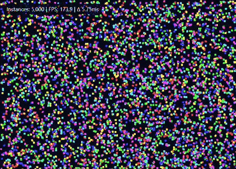

# Kurogane: A composable Chromium runtime for Rust

Build high-performance, GPU-accelerated desktop applications on Chromium, or embed it directly into existing applications.

Kurogane is a Rust-native runtime built on [Chromium Embedded Framework (CEF)](https://en.wikipedia.org/wiki/Chromium_Embedded_Framework), bringing Chromium to desktop applications while giving you control over windowing, event loops and lifecycle when you need it.

<p align="center">
  <br>
  <b>Chromium, on your terms.</b>
</p>

## Getting started

### 1. Install Kurogane CLI (one-time)

```bash
cargo install --git https://github.com/0x48piraj/kurogane kurogane-cli
```

> Note: For platform-specific setup and troubleshooting, see [install notes](docs/platforms.md).

### 2. Try it

Run the built-in showcase and see Kurogane in action:

```bash
kurogane showcase
```

## Create a project

Start with one of the official starters, or bring your own Cargo Generate-compatible template.

| Starter   | TypeScript | JavaScript | Best for                |
| --------- | :--------: | :--------: | ----------------------- |
| `minimal` |      ✔️     |      ✔️     | Smallest starting point |
| `react`   |      ✔️     |      ✔️     | React applications      |
| `svelte`  |      ✔️     |      ✔️     | Svelte applications     |
| `vue`     |      ✔️     |      ✔️     | Vue applications        |

```bash
kurogane new
```

Or choose one directly:

```bash
kurogane new react
```

See [Templates](docs/templates.md) for custom templates, caching and authoring.

### Run your app

From your new project:

```bash
kurogane dev
```

Launches the development workflow and automatically resolves the required Chromium runtime.

### Add Kurogane to an existing app

Already have a frontend project? `init` integrates Kurogane around it without touching your files:

```sh
cd my-vite-app
kurogane init
# or non-interactive:
kurogane init --assets dist --dev-url http://localhost:5173
```

See [Development](docs/development.md) for frontend dev servers, runtime configuration and advanced workflows.

## Production packaging

Kurogane does not impose a packaging format.

In production, the embedding application is responsible for bundling frontend assets and selecting the startup URL.

For convenience, we include a straightforward way to do this:

```bash
kurogane bundle
```

Outputs a distributable app in the `dist/` directory.

> **Note:** The bundling workflow is still under active development and should be considered experimental.

## Motivation

This started as a GPU-accelerated visualization tool built on **Tauri** that performed well on **Windows (WebView2)** out-of-the-box but encountered hard limitations on **Linux**.

System WebViews vary across platforms: WebKitGTK on Linux, WebView2 on Windows and WKWebView on macOS. This variation affects rendering behavior, GPU paths and performance characteristics that are not directly controllable from the application layer.

Those constraints are inherent to _system WebViews_.

Switching to [CEF](https://github.com/chromiumembedded/cef) removes platform-level rendering variability but introduces a new set of tradeoffs around integration, lifecycle management and process coordination.

The alternatives weren't satisfying either. **Electron** provides a complete application platform built around Chromium and Node.js, but that convenience comes with a predefined runtime and application model. Building directly on Chromium provides maximum control, but is complex, fragile and expensive to maintain without a solid abstraction layer.

Kurogane exists as that layer, built for Rust.

## What Kurogane is built for

* **Applications with existing architecture:** Supports embedding into host-managed environments with an existing event loop, window hierarchy, or GUI framework. Kurogane integrates Chromium as a component within the application, while the host retains control over execution flow and window ownership.
* **High-frequency rendering workloads:** WebGL, Canvas, WASM-heavy visualization, anything where rendering behavior across platforms matters and where you cannot accept the variance that system WebViews introduce
* **Developers who want Chromium-based rendering without Electron:** No embedded Node.js runtime. No imposed process model. Direct access to Chromium's lifecycle hooks.
* **Building custom desktop shells, engines or non-standard desktop applications:** Applications that need direct control over browser process lifecycle, renderer-side extension points, or fine-grained IPC between Rust and JavaScript.

> Anyone who likes Tauri's philosophy but prefers Chromium instead of WebViews.

When you should *not* use this project:

* You want the smallest binary: use [Tauri](https://tauri.app)
* You want Node.js APIs: use [Electron](https://www.electronjs.org)
* You're building a standard CRUD UI: _use either Tauri or Electron_

This project is not intended as a replacement for Tauri or Electron. Kurogane optimizes for control over convenience and breadth.

## 🚧 Current status

Early days! Architecture and APIs may change as the project evolves.

#### Roadmap

- [x] Cross-platform Rust-native CEF runtime integration (process model, browser lifecycle, shutdown correctness)
- [x] Modular runtime architecture with clear ownership boundaries
- [x] External event-loop integration
- [x] Native window creation and lifecycle management (CEF Views + embedded mode)
- [x] GPU-backed rendering pipeline via Chromium (CEF integration layer)
- [x] File-based and dev-server frontend loading
- [x] Linux and Windows support
- [x] Example suite covering core runtime capabilities
  - Rendering: Canvas, WebGL/2, WASM, DOM workloads
  - IPC: structured Rust <-> JS communication examples
  - Windowing: multi-window orchestration, popup flows, delegate handling
  - Stress testing: popup cascades, lifecycle edge cases
  - Integrations: winit-based embedding and external event-loop scenarios
- [x] Custom application protocol subsystem
  - Scheme handler implementation
  - Resource loading pipeline (file / dev-server / custom protocols)
  - URL routing and request interception inside CEF
- [x] Structured IPC system between Rust and renderer processes
- [x] Higher-level application runtime API
- [x] Packaging and distribution tooling
- [x] Project scaffolding / template system (CLI-driven generation)
- [x] First-class starters (vanilla, react, svelte, vue) with language selection

#### In progress / planned

- [ ] End-to-end packaging pipeline (cross-platform artifacts)
- [x] CI pipeline for runtime validation

##### Platform support

| Platform | Status |
|----------|--------|
| Linux    | Supported |
| Windows  | Supported |
| macOS    | Development only; packaging and signing not implemented ([notes](docs/platforms.md#macos)) |

## Philosophy

Kurogane is built around one clear idea: **Chromium should be composable.**

* **The host application can own the architecture:** Your event loop, your windows, your application lifecycle.
* **Kurogane provides the developer experience:** Tooling, templates, dev server routing and high-performance Rust IPC, all while giving you complete control over the application lifecycle.

The longer-term ambition isn't to build another opinionated framework. It's to give Rust developers modern tooling and a high-performance browser runtime without hiding the architecture behind a black box.
