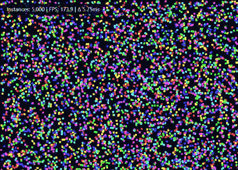

# Kurogane: A composable Chromium runtime for Rust

Build high-performance, GPU-accelerated desktop applications on Chromium or embed it directly into existing applications.

Kurogane is a Rust-native runtime built on [Chromium Embedded Framework (CEF)](https://en.wikipedia.org/wiki/Chromium_Embedded_Framework), bringing Chromium to desktop applications while giving you control over windowing, event loops and lifecycle when you need it.

<p align="center">
  <br>
  <b>Chromium, on your terms.</b>
</p>

## Getting started

### 1. Install Kurogane CLI (one-time)

#### Linux / macOS

```bash
curl --proto '=https' --tlsv1.2 -LsSf https://kurogane-rs.org/install.sh | sh
```

#### Windows

```powershell
powershell -c "irm https://kurogane-rs.org/install.ps1|iex"
```

> [!NOTE]
> See [Installing Kurogane](docs/install.md) for installer options and [install notes](docs/platforms.md) for platform specifics.

### For Rustaceans 🦀

Want the bleeding-edge Kurogane? If you already have Rust installed:

```bash
cargo install --git https://github.com/0x48piraj/kurogane kurogane-cli
```

> [!IMPORTANT]
> This pulls the latest development code. It may be ahead of the latest release and come with a few rough edges.

### 2. Try it

Run the built-in showcase and see Kurogane in action:

```bash
kurogane showcase
```

## Create a project

Start with one of the official starters or bring your own project.

```bash
kurogane new
```

Or choose one directly:

```bash
kurogane new react
```

See [templates](docs/templates.md) for custom templates and authoring.

### Run your app

From your new project:

```bash
npm --prefix frontend install     # install frontend dependencies once
npm --prefix frontend run dev     # start the dev server
kurogane dev                      # launch the app at the dev server
```

`kurogane dev` runs your app in debug mode and installs the Chromium runtime it needs when it is missing. The dev server and the Kurogane window run together during development.

### Add Kurogane to an existing app

Already have a frontend project? `init` integrates Kurogane around it without touching your files:

```sh
cd my-vite-app
kurogane init
# or non-interactive:
kurogane init --assets dist --dev-url http://localhost:5173
```

See [development](docs/development.md) for frontend dev servers, runtime configuration and advanced workflows.

## Production packaging

Once your Kurogane app works you can turn it into a standalone app to share with other people.

Run:

```bash
kurogane bundle
```

That's it.

Kurogane packages your app with everything it needs to run. That includes the Chromium runtime and your built frontend.

The finished app is placed in `dist/`.

> [!TIP]
> #### Something went wrong?
>
> You don't need to understand how Kurogane's bundler works to fix most problems. _That's what we're telling ourselves anyway._
>
> Go straight to [troubleshooting](docs/bundling.md#troubleshooting).
>
> Want to know how the bundler works under the hood? That's what [bundling](docs/bundling.md) is for. It's mostly for contributors, debugging and people who enjoy reading packaging code for fun.

### Want a specific format?

You usually don't need to choose one. Kurogane picks the default format for your platform.

Pick a specific format with one of these:

```bash
# Linux single-file AppImage
kurogane bundle --format appimage

# Windows NSIS installer
kurogane bundle --format nsis

# macOS app bundle and DMG
kurogane bundle --format app
```

> [!NOTE]
> Bundles are platform-specific. You must build an app on the platform you're packaging for. You can't build a Linux AppImage from Windows or a macOS `.app` from Linux.

### First time bundling?

`kurogane bundle` and `kurogane dev` install the Chromium runtime your app uses when it is missing. Download it ahead with:

```bash
kurogane install
```

You normally only need this once per Chromium version.

### Have a frontend?

Kurogane can build your app's frontend before packaging.

`kurogane bundle` runs your configured frontend build command and includes the finished frontend in your app.

No build command? Build your frontend yourself before bundling.

> **Side note:** Bundling is still experimental. Something broke? Congratulations.
>
> You've found the edge case. _Also tell us what the fuck you did._

## Motivation

This started as a GPU-accelerated visualization tool built on **Tauri** that performed well on **Windows (WebView2)** out-of-the-box but encountered hard limitations on **Linux**.

System WebViews vary across platforms. Linux has WebKitGTK, Windows has WebView2 and macOS has WKWebView. This variation affects rendering behavior, GPU paths and performance characteristics that are not directly controllable from the application layer.

Those constraints are inherent to _system WebViews_.

Switching to [CEF](https://github.com/chromiumembedded/cef) removes platform-level rendering variability but introduces a new set of tradeoffs around integration, lifecycle management and process coordination.

The alternatives weren't satisfying either. **Electron** provides a complete application platform built around Chromium and Node.js. That convenience comes with a predefined runtime and application model. Building directly on Chromium gives maximum control but is complex, fragile and expensive to maintain without a solid abstraction layer.

Kurogane exists as that layer for Rust.

## What Kurogane is built for

* **Applications with existing architecture:** Supports embedding into host-managed environments with an existing event loop, window hierarchy or GUI framework. Kurogane integrates Chromium as a component of the application. The host keeps control over execution flow and window ownership.
* **High-frequency rendering workloads:** WebGL, Canvas and WASM-heavy visualization. Anything where rendering behavior across platforms matters and the variance of system WebViews is not acceptable.
* **Developers who want Chromium-based rendering without Electron:** No embedded Node.js runtime. No imposed process model. Direct access to Chromium's lifecycle hooks.
* **Building custom desktop shells, engines or non-standard desktop applications:** Applications that need direct control over browser process lifecycle, renderer-side extension points or fine-grained IPC between Rust and JavaScript.

> Anyone who likes Tauri's philosophy but prefers Chromium instead of WebViews.

When you should *not* use this project:

* You want the smallest binary: use [Tauri](https://tauri.app)
* You want Node.js APIs: use [Electron](https://www.electronjs.org)
* You're building a standard CRUD UI: _use either Tauri or Electron_

This project is not intended as a replacement for Tauri or Electron. Kurogane optimizes for control over convenience and breadth.

## 🚧 Current status

Early days! Architecture and APIs may change as the project evolves.

#### Roadmap

- [x] Cross-platform Rust-native CEF runtime integration (process model, browser lifecycle, shutdown correctness)
- [x] Own CEF bindings ([tetsu](https://github.com/kurogane-rs/tetsu)) that load Chromium when the app starts
- [x] Modular runtime architecture with clear ownership boundaries
- [x] External event-loop integration
- [x] Native window creation and lifecycle management (CEF Views + embedded mode)
- [x] GPU-backed rendering pipeline via Chromium (CEF integration layer)
- [x] File-based and dev-server frontend loading
- [x] Linux, Windows and macOS support
- [x] Example suite covering core runtime capabilities
  - Rendering: Canvas, WebGL/2, WASM and DOM workloads
  - IPC: structured Rust <-> JS communication examples
  - Windowing: multi-window orchestration, popup flows and delegate handling
  - Stress testing: popup cascades and lifecycle edge cases
  - Integrations: winit-based embedding and external event-loop scenarios
- [x] Custom application protocol subsystem
  - Scheme handler implementation
  - Resource loading pipeline (file / dev-server / custom protocols)
  - URL routing and request interception inside CEF
- [x] Structured IPC system between Rust and renderer processes
- [x] Per-origin access control for commands, events and streams
- [x] Native filesystem capability with per-origin grants
- [x] Application policies for navigation, new windows, downloads, permissions, context menus, keys, file dialogs and drags
- [x] Chromium sandbox on Linux, Windows and macOS
- [x] Higher-level application runtime API
- [x] Packaging and distribution tooling
- [x] Project scaffolding / template system (CLI-driven generation)
- [x] First-class starters (minimal, react, svelte, vue) with language selection
- [x] One-line installers with `kurogane self uninstall`
- [x] CI pipeline for runtime validation

#### In progress / planned

- [ ] End-to-end packaging pipeline (cross-platform artifacts)
- [ ] macOS notarization
- [ ] Wayland embedding

##### Platform support

| Platform | Status |
|----------|--------|
| Linux    | Supported |
| Windows  | Supported |
| macOS    | Supported (dev, `.app` bundle + `.dmg` via `--format app`, optional signing; [notes](docs/platforms.md#macos)) |

## Philosophy

Kurogane is built around one clear idea. **Chromium should be composable.**

* **The host application can own the architecture:** Your event loop, your windows and your application lifecycle.
* **Kurogane provides the developer experience:** Tooling, templates, dev server routing and high-performance Rust IPC. You keep complete control over the application lifecycle.

The longer-term ambition isn't to build another opinionated framework. It's to give Rust developers modern tooling and a high-performance browser runtime without hiding the architecture behind a black box.
