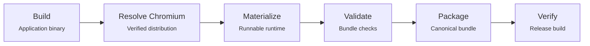
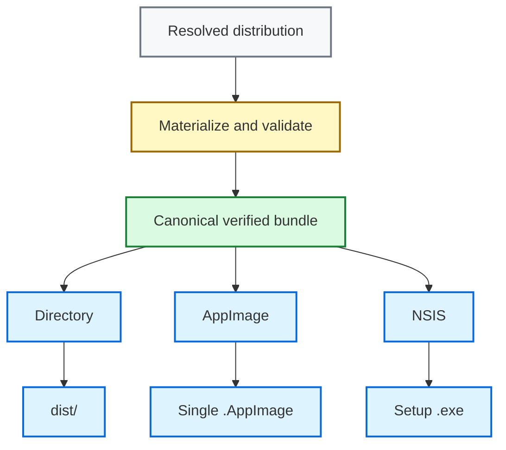
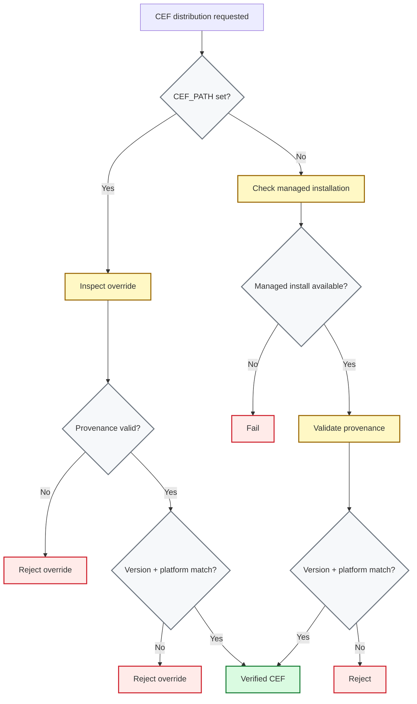
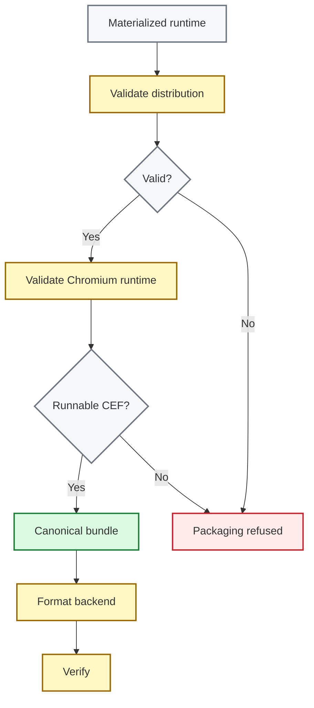

# Bundling

End-to-end guide for packaging Kurogane applications into distributable bundles.

## Overview

Kurogane's bundler takes your compiled binary, Chromium runtime and frontend assets and produces a self-contained distributable. The process is:



All three output formats share the same input: a [`ResolvedDistribution`](https://github.com/0x48piraj/kurogane/blob/2caa063cf8cd32352a57f5691417750b2bf3bc2d/kurogane-layout/src/distribution.rs#L36) that captures *what* goes into the bundle, plus the same canonical directory layout produced by [`package_directory()`](https://github.com/0x48piraj/kurogane/blob/2caa063cf8cd32352a57f5691417750b2bf3bc2d/kurogane-layout/src/package.rs#L21).

### Available formats

| Format | Flag | Platform |
|--------|------|----------|
| Directory | `--format dir` | Linux, Windows |
| AppImage | `--format appimage` | Linux only |
| NSIS | `--format nsis` | Windows only |

All formats start from the same verified bundle. The format-specific backends only wrap that bundle for distribution.



## Prerequisites

### Required

- **Rust** (stable, with `cargo`)
- **Chromium runtime** installed via `kurogane install` (see [Chromium resolution](#chromium-resolution))

### Optional

- **Frontend assets:** If your project has a built frontend, Kurogane will include the contents of `frontend/dist/`. You can omit this directory for applications without a frontend.
- **NSIS:** Windows bundles created with `--format nsis` require NSIS. Install it from [nsis.sourceforge.io](https://nsis.sourceforge.io), or set `NSIS_PATH` to your `makensis.exe`.
- **Code signing:** Signing requires either `osslsigncode` or `signtool.exe`. See [Code signing](#code-signing) for configuration details.

> [!NOTE]
> You do not need to understand the bundling internals to use `kurogane bundle`. Pick a format, run the command, and Kurogane handles the rest. The sections below go into the mechanics for contributors and anyone debugging or extending the bundler.
>
> For the quick path, see [Quick start](#quick-start). If something goes wrong, jump straight to [Troubleshooting](#troubleshooting).

> [!TIP]
> For most projects, bundling is just:
>
> ```bash
> kurogane bundle
> ```
>
> Use `--format appimage` or `--format nsis` when you need a specific distribution format.

## Chromium resolution

The bundler resolves the CEF distribution with an override-first policy:

1. **`CEF_PATH` override**: Accepted **only** when the directory contains an `archive.json` provenance file whose recorded version and platform match the build. An unverifiable or mismatched override is rejected rather than silently packaged. A set-but-broken `CEF_PATH` is a hard error, never a silent fallback.
2. **Managed installation**: `~/.local/share/kurogane/cef/<version>/`, populated by `kurogane install`. Subjected to the same version/platform/provenance verification as overrides.

Chromium resolution prefers `CEF_PATH` when it is set, but an invalid override is an error rather than a fallback. Otherwise Kurogane uses the managed installation.

> [!IMPORTANT]
> Release bundles require a verifiable Chromium distribution. A local CEF checkout without `archive.json` will not be packaged.

The strictness is deliberate: release artifacts must be traceable to an official Chromium distribution. A bare developer checkout (e.g. a locally built CEF tree) has no provenance record and cannot be shipped by accident, regardless of where it comes from.



### Provenance

`kurogane install` writes `archive.json` next to every managed installation:

```json
{
  "type": "minimal",
  "name": "cef_binary_150.0.10+g8042e43+chromium-150.0.7871.101_linux64_minimal.tar.bz2",
  "sha1": "..."
}
```

An override passes verification when:

* **The Chromium version** matches the expected version exactly, or includes a `+g<hash>` suffix (for example, expected `150.0.10` matches `150.0.10+g8042e43`).
* **The platform name** matches the current target.

### Resolution errors

| Error | Meaning | Fix |
|-------|---------|-----|
| `NotFound` | No managed install for the expected version and no `CEF_PATH` override | Run `kurogane install` |
| `OverrideMissing` | `CEF_PATH` points to a nonexistent path | Correct the variable |
| `UnverifiableOverride` | `CEF_PATH` has no `archive.json` | Use a managed install or an official distribution |
| `UnverifiableManaged` | Managed installation has no `archive.json` | Re-run `kurogane install` |
| `VersionMismatch` | Resolved Chromium version differs from the build's Chromium | Install the matching version |
| `PlatformMismatch` | Resolved Chromium was built for another platform | Install the matching platform archive |

## Runtime materialization

A resolved distribution is not copied into the bundle as-is. Kurogane first materializes a flat, runnable runtime into a per-version cache inside the Cargo target directory:

```
<target-dir>/kurogane/cef-runtime/<full-version>/
```

(e.g. `target/kurogane/cef-runtime/150.0.10+g8042e43/`). The cache is reused when it passes validation and rebuilt otherwise.

Materialization accepts either distribution shape (raw official archives with `Release/` + `Resources/`, or already-flattened trees) and excludes, by construction:

- **Development material**: `include/`, `cmake/`, `libcef_dll/`, `CMakeLists.txt`, `CREDITS.html`
- **Download-cache residue**: `archive.json`, the original `*.tar.bz2` archive

Everything else required at runtime is kept verbatim.

## Quick start

```bash
# One-time: install the Chromium runtime
kurogane install

# Bundle (directory format by default)
kurogane bundle

# Output: dist/
```

### AppImage (Linux single-file)

```bash
kurogane bundle --format appimage

# Output: dist/myapp_1.0.0_x86_64.AppImage
```

### Windows installer

```powershell
kurogane bundle --format nsis

# Output: dist/myapp_1.0.0_x64-setup.exe
```

## Command reference

```
kurogane bundle [OPTIONS]

Options:
  --format <FORMAT>          Output format: dir, appimage, nsis [default: dir]
  --debug                    Bundle debug build instead of release
  --sign                     Sign bundle binaries and the final artifact using
                             the [signing] table in kurogane.toml
```

### Debug bundles

Use `--debug` for development/testing without full optimization:

```bash
kurogane bundle --debug
```

This runs `cargo build` with the `kurogane/debug` feature flag instead of `--release`.

## Output layouts

### Linux directory (`--format dir`)

The directory format is the canonical Linux bundle: a small launcher around the application binary and a flat Chromium runtime.

```
dist/
├── myapp                      # launcher script
├── runtime/
│   ├── myapp                  # actual binary (RUNPATH $ORIGIN/cef)
│   └── cef/                   # flat Chromium runtime
│       ├── libcef.so
│       ├── locales/
│       ├── icudtl.dat
│       ├── chrome-sandbox     # present but inert (see below)
│       └── ...
├── content/                   # frontend (if present)
│   └── index.html
└── assets/                    # extra resources (if present)
```

Users run the launcher:

```bash
./dist/myapp
```

#### Launcher contract

The launcher script does exactly two things:

```sh
#!/usr/bin/env sh
set -eu
ROOT="$(CDPATH= cd -- "$(dirname -- "$0")" && pwd)"
cd "$ROOT" # anchors the working directory
exec "$ROOT/runtime/myapp" "$@"
```

> [!NOTE]
> Kurogane does not set `LD_LIBRARY_PATH` for normal Linux bundles. Library loading is handled by the executable's RUNPATH.

#### Library loading (RPATH)

Projects created with `kurogane new` get this baked in at link time via `.cargo/config.toml`:

```toml
[target.'cfg(all(unix, not(target_os = "macos")))']
rustflags = ["-C", "link-arg=-Wl,-rpath,$ORIGIN/cef"]
```

This covers all Linux targets (x86_64 and aarch64). The loader then finds `libcef.so` in `<exe_dir>/cef` with no environment setup.

For *exotic* environments (e.g. NixOS), there is one opt-in escape hatch, never applied automatically:

```bash
KUROGANE_LD_LIBRARY_PATH=/nix/store/...-lib:/nix/store/... ./dist/myapp
```

#### Sandbox note

Kurogane sets `no_sandbox = 1` on Linux, so `chrome-sandbox` ships as an inert file without setuid bits. If the sandbox policy ever flips, no packaging change is needed, the file is already in place.

### Windows directory (`--format dir`)

```
dist/
├── myapp.exe                  # binary (beside libcef.dll)
├── libcef.dll
├── chrome_elf.dll
├── locales/
├── icudtl.dat
├── v8_context_snapshot.bin
├── content/                   # frontend (if present)
│   └── index.html
└── assets/                    # extra resources (if present)
```

Windows places Chromium beside the executable because the Windows loader searches the executable directory for DLL dependencies automatically.

> [!IMPORTANT]
> **Keep the Chromium runtime dependencies together.** On Windows, Chromium's runtime DLLs must be discoverable by the Windows loader, typically by placing them alongside the application executable (or on `PATH`).

### Linux AppImage (`--format appimage`)

AppImage wraps the canonical directory bundle rather than rebuilding it.

```
dist/
└── myapp_1.0.0_x86_64.AppImage    # single self-contained file
```

Internal structure (visible via `myapp.AppImage --appimage-extract`):

```
squashfs-root/
├── AppRun                           # thin entry point
├── myapp.desktop                    # deployed to root by linuxdeploy
├── myapp.png                        # deployed to root by linuxdeploy
├── .DirIcon -> myapp.png            # created by linuxdeploy
└── usr/
    ├── lib/myapp/                   # the canonical directory bundle
    │   ├── myapp                    # launcher script
    │   ├── runtime/
    │   │   ├── myapp                # binary (RUNPATH $ORIGIN/cef)
    │   │   └── cef/                 # Chromium runtime
    │   ├── content/                 # frontend (if present)
    │   └── <extra resources>
    ├── share/applications/myapp.desktop
    └── share/icons/hicolor/256x256/apps/myapp.png
```

The canonical bundle is staged **verbatim** at `usr/lib/<name>/`; the exact artifact `--format dir` produces, verified by the same rules. The generated `AppRun` is three lines: resolve the AppDir, exec the bundle's launcher. All loading and working-directory concerns stay inside the bundle.

linuxdeploy contributes the desktop integration (root symlinks for desktop file, icon, `.DirIcon`) and deploys system libraries (nss, glib, atk, ...) that Chromium links against. Two flags keep it from interfering with the bundle:

- `--deploy-deps-only <bundle>`: Resolve dependencies *for* the bundled ELFs without copying, stripping, or re-rpathing them
- `--exclude-library 'libcef*'`: The Chromium runtime can never be re-deployed out of `runtime/cef/`

Without these, linuxdeploy scans every ELF in the AppDir and duplicates the entire Chromium runtime into `usr/lib/`.

#### Desktop file quirk

In a freedesktop desktop entry, `Version=` is the *specification* version, not the application version. Arbitrary values make `desktop-file-validate` (and therefore appimagetool) fail. Kurogane writes `Version=1.0` and records the application version in `X-AppImage-Version=`.

#### Tools

First run downloads **linuxdeploy** (cached in `~/.cache/kurogane/tools/`). Subsequent builds reuse the cache.

#### Running without FUSE

On systems without FUSE (some CI runners, containers, WSL1):

```bash
./myapp_1.0.0_x86_64.AppImage --appimage-extract
./squashfs-root/AppRun
```

This extracts the identical payload and runs the real entry point. Also useful for verifying what an AppImage contains.

### Windows NSIS installer (`--format nsis`)

NSIS treats the verified directory bundle as an opaque payload and installs it wholesale.

```
dist/
├── myapp_1.0.0_x64-setup.exe       # NSIS installer
├── bundle/                          # staged canonical bundle (temporary)
└── installer.nsi                     # generated script (temporary)
```

The installer treats the application as one opaque payload: the verified canonical bundle is copied wholesale into `$INSTDIR` (`File /r "${BUNDLEDIR}\*.*"`). The installer has no opinion about Chromium layout, frontend placement, or resources; whatever the verifier accepted is what gets installed, byte-for-byte.

The installer:
- Installs per-user (default `$LOCALAPPDATA\...`, user-selectable via the directory page)
- Creates Start Menu and Desktop shortcuts pointing at the executable
- Registers in Windows Add/Remove Programs (HKCU) with estimated size
- Ships an uninstaller that removes `$INSTDIR` recursively plus shortcuts and registry keys

## Configuration

Packaging behavior is configured declaratively in `kurogane.toml` at the project root. The file is optional, an absent file (or absent keys) reproduces the historical defaults exactly. Unknown keys are ignored, so older templates keep parsing.

```toml
[app]
# Display name; defaults to the cargo package name
name = "My App"
# Frontend directory relative to the project root
frontend = "frontend/dist"
# Command to build frontend before cargo build; skipped if package.json is absent
frontend-build = "npm run build"
publisher = "Example Corp"          # NSIS Manufacturer / Add-Remove Programs Publisher
description = "A demo application"  # NSIS FileDescription
copyright = "(c) 2026 Example Corp" # NSIS LegalCopyright + BrandingText
icon = "assets/icon.png"            # AppImage hicolor icon (PNG)

[[bundle.resources]]
source = "assets/data"              # file or directory, relative to the project root
destination = "share/data"          # optional; bundle-root-relative; defaults to the source file name

[linux]
categories = ["Development", "IDE"] # .desktop Categories=; default ["Utility"]
terminal = true                     # .desktop Terminal=; default false

[windows]
start-menu-shortcut = true          # default true
desktop-shortcut = true             # default true

[signing]
certificate = "certs/codesign.pfx"  # thumbprint (signtool) or cert file (.pfx/.p12 or PEM chain)
timestamp-url = "http://timestamp.digicert.com"
digest-algorithm = "sha256"
custom-command = "signtool sign /fd sha256"  # first token is the program; %1 expands to the target path
```

Resource destinations are validated before packaging: absolute paths and `..` components are rejected.

## Extra resources

Resources declared under `[[bundle.resources]]` are placed inside the canonical bundle in every format:

- Directory format: `dist/<destination>`
- AppImage: `usr/lib/<name>/<destination>` (inside the canonical bundle)
- NSIS: `$INSTDIR\<destination>` (via the wholesale copy)

Entries without a `destination` land at the bundle root under their source file name.

## Code signing

Signing is **off by default**. Pass `--sign` to enable it; all signing parameters come from `[signing]` in `kurogane.toml`. Certificate *references* live in config files, never secrets or passwords.

```bash
kurogane bundle --format nsis --sign
```

If `--sign` is passed but no usable `[signing]` table exists (no `certificate` and no `custom-command`), the command fails with an actionable error.

### What gets signed and when

The pipeline signs PE binaries inside the staged bundle **before** format assembly, so installers embed already-signed files:

| Format | Bundle binaries | Final artifact |
|--------|-----------------|----------------|
| dir    | signed in place | n/a |
| nsis   | signed while staged | installer `.exe` signed, then verified |
| appimage | no-op on Linux | not signed |

For installer formats, binaries are signed before assembly. The final installer is then signed and verified.

Verification runs after artifact signing via the platform tool (`signtool verify /pa /all`, `osslsigncode verify`).

### Tool selection

On Windows, `signtool.exe` is preferred when available. Otherwise, Kurogane uses `osslsigncode` which is supported on all platforms.

| Tool           | Discovery order                                                     |
| -------------- | ------------------------------------------------------------------- |
| `signtool.exe` | `SignConfig.tool`, `KUROGANE_SIGNTOOL_PATH`, then Windows SDK paths |
| `osslsigncode` | `KUROGANE_OSSLSIGNCODE_PATH`, then `PATH`                           |

Only `.exe` and `.dll` files are signed. SHA-256 is the default digest; timestamps use the RFC-3161 `/tr` + `/td` pair (`signtool`) or `-ts` (`osslsigncode`). `osslsigncode` signs into a temporary file that replaces the original only on success, so a failed pass never corrupts the target.

### Certificate material

- **signtool**: set `certificate` to the certificate thumbprint.
- **osslsigncode**: set `certificate` to a PKCS#12 container (`.pfx`/`.p12`, passed via `-pkcs12`) or a PEM/DER cert chain (passed via `-certs`). Passphrases are prompted interactively by the tool.

### Custom signing command

For tools that are not directly supported, use `custom-command`. The `%1` placeholder in arguments is replaced with the target file path:

```toml
[signing]
custom-command = "azuresigntool sign -kvu https://my-vault.vault.azure.net %1"
```

(Whitespace splitting only; use a wrapper script when arguments need quoting.)

## Validation

Validation happens in two stages, using the same runtime checks throughout the packaging pipeline.



### Distribution check (pre-packaging)

[`ResolvedDistribution::validate()`](https://github.com/0x48piraj/kurogane/blob/2caa063cf8cd32352a57f5691417750b2bf3bc2d/kurogane-layout/src/distribution.rs#L78) checks:

- Executable exists and is a file (not a directory)
- Frontend directory exists and contains `index.html` (when present)
- Chromium runtime directory exists
- All extra resources exist

### Runtime check (the gate)

[`validate_cef_runtime()`](https://github.com/0x48piraj/kurogane/blob/2caa063cf8cd32352a57f5691417750b2bf3bc2d/kurogane-layout/src/cef.rs#L463) requires the complete runnable subset:

| Linux | Windows |
|-------|---------|
| `libcef.so` | `libcef.dll` |
| `chrome-sandbox` | `chrome_elf.dll` |
| `icudtl.dat` | `icudtl.dat` |
| `locales/` | `locales/` |
| `v8_context_snapshot.bin` *or* `snapshot_blob.bin` | `v8_context_snapshot.bin` *or* `snapshot_blob.bin` |

(The V8 snapshot filename varies across Chromium versions; either spelling satisfies the check.)

Every format runs this check after materializing: [`package_directory()`](https://github.com/0x48piraj/kurogane/blob/2caa063cf8cd32352a57f5691417750b2bf3bc2d/kurogane-layout/src/package.rs#L21) refuses to emit a bundle with an incomplete runtime. A bundle that exists on disk has passed the gate. There is no "partial Chromium for testing" mode anymore.

## Frontend-less bundles

If your app has no HTML frontend (e.g., pure Rust with IPC), omit the `frontend/dist/` directory:

```bash
# No frontend/dist/ directory present
kurogane bundle
# Warns: "No frontend/dist/ directory found"
# Bundle proceeds without frontend
```

The bundle will not contain a `content/` directory and [`verify()`](https://github.com/0x48piraj/kurogane/blob/2caa063cf8cd32352a57f5691417750b2bf3bc2d/kurogane-layout/src/distribution.rs#L78) will not require `index.html`.

## Troubleshooting

### No usable Chromium distribution

No managed installation exists for the expected version. Run:

```bash
kurogane install
```

`kurogane doctor` shows the expected version, the expected path and all installed versions.

### "CEF_PATH override has no archive.json" / Unverifiable override

You pointed `CEF_PATH` at a directory without provenance (e.g. a manually extracted or self-built CEF tree). Release bundling requires traceable provenance.

Use `kurogane install`, or point `CEF_PATH` at an official distribution that includes `archive.json`.

### "version mismatch" / "platform mismatch" on CEF_PATH

The override exists but doesn't match the Chromium version this kurogane build links against, or was built for another platform. Check the expected values in the error message; `kurogane doctor` prints them too.

### "missing required file: ..." during packaging

The resolved distribution failed the runtime gate (see above).

Re-run `kurogane install`; if overriding via `CEF_PATH`, ensure you have the complete distribution.

### "NSIS not found" (Windows)

Install NSIS from [nsis.sourceforge.io](https://nsis.sourceforge.io) or set:

```powershell
$env:NSIS_PATH = "C:\Program Files\NSIS\makensis.exe"
```

### "linuxdeploy failed" (Linux)

Read the tool output above the error. Common causes:

- **Icon errors**: The desktop file's `Icon=` must match a file under `usr/share/icons/hicolor/**`. Kurogane installs a placeholder automatically; custom icons should go into the hicolor theme.
- **Desktop file validation**: `Version=` must be a specification version (`1.0`), not your app version.
- **FUSE unavailable**: `linuxdeploy` runs with `APPIMAGE_EXTRACT_AND_RUN=1` internally, but if the environment blocks extraction entirely, run the build on a FUSE-capable host.

To inspect or run a produced AppImage without FUSE, see [Running without FUSE](#running-without-fuse).

### App launches but window is blank / content missing

The launcher sets the working directory to the bundle root, so frontend files must be available under `content/`. If your application loads content by absolute path, prefer `App::new("content")` so the path remains valid when the bundle is relocated, such as from a directory bundle to an AppImage or installed location.
