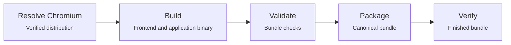
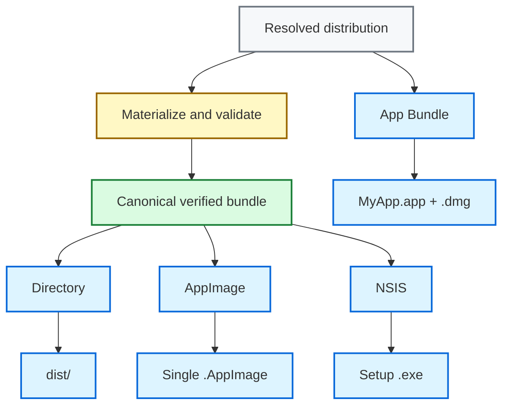
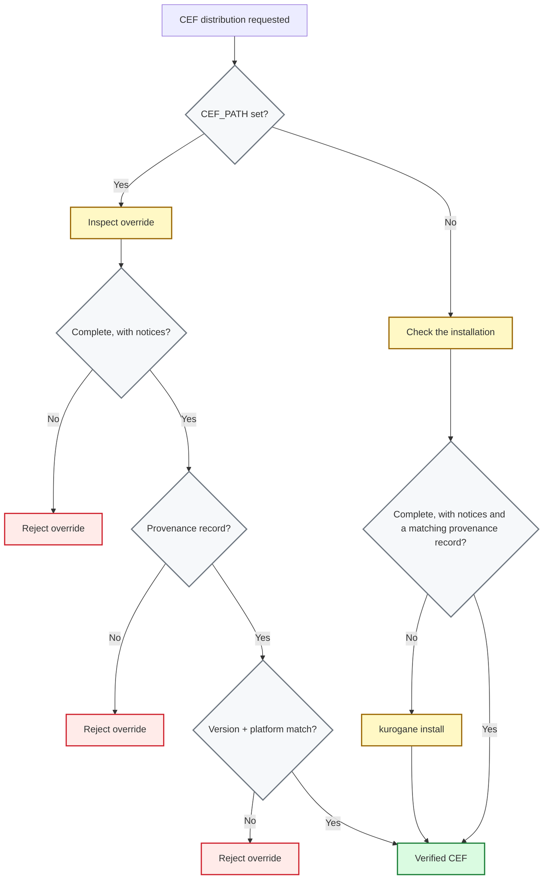
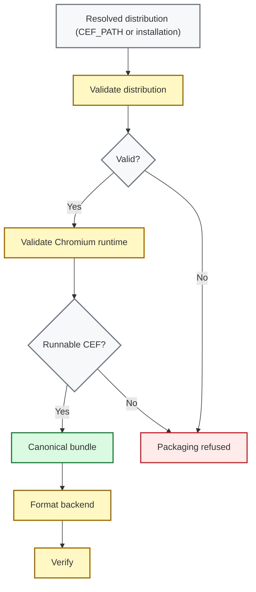

# Bundling

End-to-end guide for packaging Kurogane applications into distributable bundles.

## Overview

Kurogane's bundler takes your compiled binary, the Chromium runtime and your frontend assets and produces a self-contained distributable. The process is:


```mermaid
flowchart LR
    A["Resolve Chromium<br/><span style='font-size:12px'>Verified distribution</span>"]
    B["Build<br/><span style='font-size:12px'>Frontend and application binary</span>"]
    C["Validate<br/><span style='font-size:12px'>Bundle checks</span>"]
    D["Package<br/><span style='font-size:12px'>Canonical bundle</span>"]
    E["Verify<br/><span style='font-size:12px'>Finished bundle</span>"]

    A --> B --> C --> D --> E
```

Every output format shares the same input. A [`ResolvedDistribution`](https://github.com/0x48piraj/kurogane/blob/a26964dda3d8f6192a6d79e4292f731019814723/kurogane-cli/src/distribution/mod.rs#L61) captures *what* goes into the bundle. Directory, AppImage and NSIS also share the canonical directory layout [`package_directory()`](https://github.com/0x48piraj/kurogane/blob/a26964dda3d8f6192a6d79e4292f731019814723/kurogane-cli/src/distribution/package.rs#L19) produces. The macOS `.app` is assembled straight from the distribution because a bundle is not a flat directory.

### Available formats

| Format | Flag | Platform |
|--------|------|----------|
| Directory | `--format dir` | Linux, Windows |
| AppImage | `--format appimage` | Linux only |
| NSIS | `--format nsis` | Windows only |
| App Bundle | `--format app` | macOS only |

All formats start from the same verified distribution. The format-specific backends only lay it out and wrap it for distribution.


```mermaid
flowchart TD
    A["Resolved distribution"]
    B["Materialize and validate"]
    C["Canonical verified bundle"]

    A --> B --> C

    C --> D["Directory"]
    C --> E["AppImage"]
    C --> F["NSIS"]
    A --> G["App Bundle"]

    D --> D1["dist/"]
    E --> E1["Single .AppImage"]
    F --> F1["Setup .exe"]
    G --> G1["MyApp.app + .dmg"]

    classDef source fill:#f6f8fa,stroke:#6e7781,stroke-width:2px;
    classDef process fill:#fff8c5,stroke:#9a6700,stroke-width:2px;
    classDef verified fill:#dafbe1,stroke:#1a7f37,stroke-width:2px;
    classDef format fill:#ddf4ff,stroke:#0969da,stroke-width:2px;

    class A source;
    class B process;
    class C verified;
    class D,E,F,G,D1,E1,F1,G1 format;
```

## Prerequisites

### Required

* **Rust:** stable with `cargo`
* **Chromium runtime:** `kurogane bundle` installs it when it is missing (see [Chromium resolution](#chromium-resolution))

### Optional

* **Frontend assets:** Kurogane includes the directory `frontend-dist` names in `kurogane.toml` (`frontend/dist/` for example). Applications without a frontend leave it out.
* **NSIS:** Windows bundles made with `--format nsis` need NSIS. Install it from [nsis.sourceforge.io](https://nsis.sourceforge.io) or set `NSIS_PATH` to your `makensis.exe`.
* **macOS `.app`:** `--format app` needs `hdiutil` and `sips` for an icon. Both ship with macOS. `--sign` also needs `codesign` from the Xcode Command Line Tools.
* **Code signing:** Signing needs `osslsigncode` or `signtool.exe` on Windows and `codesign` on macOS. See [Code signing](#code-signing) for configuration details.
* **Linux bundles:** An app needs at least the glibc of the machine that built it. Build Linux bundles on the oldest distribution you support.

> [!NOTE]
> You do not need to understand the bundling internals to use `kurogane bundle`. Pick a format, run the command and Kurogane handles the rest. The sections below cover the mechanics for contributors and anyone debugging or extending the bundler.
>
> For the quick path see [Quick start](#quick-start). If something goes wrong jump straight to [Troubleshooting](#troubleshooting).

> [!TIP]
> For most projects bundling is just:
>
> ```bash
> kurogane bundle
> ```
>
> It produces a directory bundle on Linux and Windows and a `.app` with a
> `.dmg` on macOS. Use `--format appimage` or `--format nsis` for a specific
> distribution format.

## Chromium resolution

The bundler resolves the CEF distribution with an override-first policy:

1. **`CEF_PATH` override:** Accepted **only** when the directory holds a complete runtime with CEF's notices (`LICENSE.txt` and `CREDITS.html`) and an `archive.json` provenance file. Its recorded version and platform must match the build. An unverifiable or mismatched override is rejected and never packaged. A `CEF_PATH` that is set but broken is a hard error and never falls back.
2. **Installation:** tetsu's shared installation of the CEF version the application loads. It lives at `tetsu/cef/<version>/cef_<os>_<arch>/` in the local data directory (`~/.local/share`, `%LOCALAPPDATA%` or `~/Library/Application Support`). `kurogane install` fills it. It passes the same checks as `CEF_PATH`.

Resolution prefers `CEF_PATH` when it is set. Otherwise Kurogane uses the installation of the project's CEF version. It installs it first when it is missing, incomplete or unverified. Chromium is resolved before the frontend is built.

`kurogane install` downloads from CEF's build server (`cef-builds.spotifycdn.com`). `CEF_DOWNLOAD_URL` names a mirror instead.

This decides only what is copied into the bundle. The bundled application then runs that copy and nothing else (see [Windows directory](#windows-directory---format-dir)).

> [!IMPORTANT]
> Every bundle needs a verifiable Chromium distribution. That includes a `--debug` bundle. A local CEF checkout without `archive.json` is never packaged.

Every bundle must trace back to an official Chromium distribution. A bare developer checkout (a locally built CEF tree for example) has no provenance record. It cannot be shipped by accident wherever it comes from.


```mermaid
flowchart TD
    A["CEF distribution requested"]

    A --> B{"CEF_PATH set?"}

    B -->|Yes| C["Inspect override"]
    B -->|No| F["Check the installation"]

    C --> D{"Complete, with notices?"}
    D -->|No| E["Reject override"]
    D -->|Yes| L{"Provenance record?"}
    L -->|No| H["Reject override"]
    L -->|Yes| G{"Version + platform match?"}
    G -->|No| M["Reject override"]
    G -->|Yes| I["Verified CEF"]

    F --> J{"Complete, with notices and a matching provenance record?"}
    J -->|No| K["kurogane install"]
    K --> I
    J -->|Yes| I

    classDef decision fill:#f6f8fa,stroke:#6e7781,stroke-width:2px;
    classDef process fill:#fff8c5,stroke:#9a6700,stroke-width:2px;
    classDef success fill:#dafbe1,stroke:#1a7f37,stroke-width:2px;
    classDef failure fill:#ffebe9,stroke:#cf222e,stroke-width:2px;

    class B,D,G,J,L decision;
    class C,F,K process;
    class I success;
    class E,H,M failure;
```

### Provenance

`kurogane install` writes `archive.json` into every installation:

```json
{
  "type": "minimal",
  "name": "cef_binary_154.0.33+ga03e714+chromium-154.0.8037.94_linux64_minimal.tar.bz2",
  "sha1": "..."
}
```

`export-cef-dir` writes it too. A distribution from `CEF_PATH` or the installation passes verification when:

* **The runtime** is complete and carries CEF's notices.
* **The CEF version** in the archive's name equals the project's exactly. The `+g<hash>` commit after it does not count. `154.0.33+ga03e714` matches the expected `154.0.33` and `154.0.34` does not.
* **The platform name** matches the current target.

### Resolution errors

| Error | Meaning | Fix |
|-------|---------|-----|
| `NotInstalled` | The project's CEF version is not installed and `CEF_PATH` is not set | Run `kurogane install` |
| `CefPathMissing` | `CEF_PATH` names no directory | Correct the variable |
| `InvalidRuntime` | The runtime `CEF_PATH` names is incomplete | Point `CEF_PATH` at a distribution `export-cef-dir` wrote or unset it |
| `MissingNotice` | The runtime `CEF_PATH` names has no `LICENSE.txt` or `CREDITS.html` | Point `CEF_PATH` at a distribution `export-cef-dir` wrote or unset it |
| `Unverified` | The runtime `CEF_PATH` names fails verification (causes below) | Point `CEF_PATH` at a distribution `export-cef-dir` wrote or unset it |
| `NoInstallDir` | The user has no local data directory to install Chromium into | Run as a user with a home directory |
| `UnsupportedHost` | CEF publishes no build for this host | Bundle on a supported platform |

`Unverified` names its cause:

| Cause | Meaning |
|-------|---------|
| `NoArchiveJson` | The directory has no `archive.json` |
| `UnknownArchive` | `archive.json` names a file that is not a CEF archive |
| `VersionMismatch` | The directory holds another CEF version than the project's |
| `PlatformMismatch` | The directory holds CEF for another platform |

These errors name `CEF_PATH` because `kurogane bundle` reinstalls a missing, incomplete or unverified installation itself.

## Runtime files

The bundle copies the runtime straight from the resolved distribution. It is laid out flat as tetsu writes it with libcef at its root. By construction the bundle leaves out:

* **Development material:** `include/`, `cmake/`, `libcef_dll/`, `CMakeLists.txt` and `libcef.lib`
* **Download records:** `archive.json` and the original `*.tar.bz2` archive
* **CEF's sandbox bootstraps:** `bootstrap.exe` and `bootstrapc.exe` (see [Windows directory](#windows-directory---format-dir))

Everything else the runtime needs is kept as it is. Every bundle also carries CEF's notices (`LICENSE.txt` and `CREDITS.html`). A macOS `.app` keeps them in `Contents/Resources/Chromium Embedded Framework/` outside the framework.

## Quick start

```bash
# Optional: install the Chromium runtime ahead; bundle installs it when missing
kurogane install

# Bundle (directory format by default)
kurogane bundle

# Output: dist/
```

### AppImage (Linux single-file)

```bash
kurogane bundle --format appimage

# Output: dist/myapp_1.0.0_x86_64.AppImage
```

### Windows installer

```powershell
kurogane bundle --format nsis

# Output: dist/myapp_1.0.0_x64-setup.exe
```

### macOS App Bundle

```bash
kurogane bundle --format app

# Output: dist/MyApp.app/ and dist/MyApp.dmg
```

## Command reference

```
kurogane bundle [OPTIONS]

Options:
  --format <FORMAT>          Output format: dir, appimage, nsis, app
                             [default: app on macOS, dir elsewhere]
  --debug                    Build with Cargo's dev profile instead of release
  --sign                     Sign the bundle's Windows binaries ([signing.windows])
                             or macOS app ([signing.macos]). Linux bundles are
                             not signed
  --ci                       Never prompt
```

### Debug bundles

Use `--debug` for development and testing without full optimization:

```bash
kurogane bundle --debug
```

It runs `cargo build` in Cargo's dev profile instead of `--release`. What the application logs depends on the logger it installs (see [Logging](recipes.md#logging)).

## Output layouts

### Linux directory (`--format dir`)

The directory format is the canonical Linux bundle. It holds a small launcher around the application binary and a flat Chromium runtime.

```
dist/
├── myapp                      # launcher script
├── runtime/
│   ├── myapp                  # actual binary
│   ├── kurogane-bundle        # marker: run only the runtime below
│   └── cef/                   # flat Chromium runtime
│       ├── libcef.so
│       ├── locales/
│       ├── icudtl.dat
│       ├── chrome-sandbox     # present but inert (see below)
│       └── ...
├── content/                   # frontend (if present)
│   └── index.html
└── assets/                    # extra resources (if present)
```

Users run the launcher:

```bash
./dist/myapp
```

#### Launcher contract

The binary lives one level down in `runtime/`. The bundle root needs an entry point that execs it. That is the launcher's job with one opt-in library path (see [Library loading](#library-loading)):

```sh
#!/usr/bin/env sh
set -eu

ROOT="$(CDPATH= cd -- "$(dirname -- "$0")" && pwd)"

# Opt-in library path for libraries the system's loader does not find
if [ -n "${KUROGANE_LD_LIBRARY_PATH:-}" ]; then
    export LD_LIBRARY_PATH="$KUROGANE_LD_LIBRARY_PATH${LD_LIBRARY_PATH:+:$LD_LIBRARY_PATH}"
fi

exec "$ROOT"/'runtime/myapp' "$@"
```

The executable's path is one single-quoted word. No character of a name expands in the script.

The launcher leaves the working directory alone. Resources are found from the executable's own location instead (see [Resource resolution](#resource-resolution)). That rule is the same on every platform and does not depend on how the application was launched.

> [!NOTE]
> Kurogane does not set `LD_LIBRARY_PATH` for normal Linux bundles. The application loads `libcef.so` by its path (see below).

#### Library loading

The marker beside the binary tells the application it runs from a bundle. It loads `libcef.so` by its full path in `runtime/cef`. Nothing is baked in at link time and no environment is needed on any Linux target (x86_64 and aarch64).

Some environments (NixOS for example) have a loader that does not find libcef's own system dependencies. For those there is one opt-in escape hatch that is never applied automatically:

```bash
KUROGANE_LD_LIBRARY_PATH=/nix/store/...-lib:/nix/store/... ./dist/myapp
```

#### Sandbox note

Apps run with `SandboxMode::Disabled` by default. `chrome-sandbox` then ships without setuid bits and stays unused. Under `SandboxMode::Chromium` the runtime sandboxes helpers through unprivileged user namespaces or else a root-owned setuid `chrome-sandbox`. It checks both at startup. An installer that wants the setuid route must `chown root:root` and `chmod 4755` the bundled `cef/chrome-sandbox`. AppImages mount `nosuid` and rely on user namespaces.

### Windows directory (`--format dir`)

```
dist/
├── myapp.exe                  # binary (beside libcef.dll)
├── myapp.exe.manifest         # CEF's application manifest
├── kurogane-bundle            # marker: run only the runtime here
├── libcef.dll
├── chrome_elf.dll
├── locales/
├── icudtl.dat
├── v8_context_snapshot.bin
├── content/                   # frontend (if present)
│   └── index.html
└── assets/                    # extra resources (if present)
```

Windows places Chromium beside the executable where CEF's sandbox bootstrap requires it. The application loads `libcef.dll` by its full path.

`myapp.exe.manifest` is the application manifest CEF's own executables carry. Windows reads it when the executable embeds none. An application whose `build.rs` calls `kurogane_build::build()` embeds the same one (see [The build script](templates.md#the-build-script)).

The empty `kurogane-bundle` file marks the directory as a bundle on every platform but macOS. There the `.app` itself does. A bundled application runs only the Chromium runtime inside its bundle and never `CEF_PATH` or the installation. It reports the bundle incomplete when that runtime is gone. Keep the marker beside the executable.

> [!IMPORTANT]
> **Keep the Chromium runtime dependencies together.** On Windows Chromium's runtime DLLs load from `libcef.dll`'s own directory and never from `PATH`. They stay beside the executable with it.

CEF's own `bootstrap.exe`, `bootstrapc.exe` and `libcef.lib` are left out of the bundle. The first two are CEF's sandbox bootstraps. A sandboxed bundle ships one under the application's own name. `libcef.lib` is an import library that nothing links or loads.

#### Sandboxed layout

An application with `sandbox = true` under `[app]` in `kurogane.toml` is built for Chromium's sandbox. The process that starts the browser brokers that sandbox. `kurogane bundle` then ships CEF's windowed bootstrap under the application's name with the application beside it as a DLL:

```
dist/
├── myapp.exe                  # CEF's bootstrap, under the app's name
├── myapp.dll                  # the application
├── myapp.exe.manifest
├── kurogane-bundle
├── libcef.dll
├── chrome_elf.dll
├── locales/
├── icudtl.dat
├── v8_context_snapshot.bin
└── content/
    └── index.html
```

CEF derives the library's name from the bootstrap's and looks for it in the bootstrap's own directory. The two names must stay in step and the bundler keeps them so. The rest of the layout is unchanged. The helper processes relaunch `myapp.exe` as they relaunch an ordinary executable.

Sign both binaries or neither. Before loading the library the bootstrap compares its certificates against its own. It refuses to start unless both are unsigned or both carry the same valid primary thumbprint. Signing only one of the pair is fatal. `kurogane bundle --sign` signs every PE file in the bundle and covers both.

See [Chromium sandbox on Windows](platforms.md#chromium-sandbox-on-windows) for the crate layout this requires.

### Linux AppImage (`--format appimage`)

AppImage wraps the canonical directory bundle and does not rebuild it.

```
dist/
└── myapp_1.0.0_x86_64.AppImage    # single self-contained file
```

Internal structure (visible with `myapp.AppImage --appimage-extract`):

```
squashfs-root/
├── AppRun                           # thin entry point
├── myapp.desktop                    # deployed to root by linuxdeploy
├── myapp.png                        # deployed to root by linuxdeploy
├── .DirIcon -> myapp.png            # created by linuxdeploy
└── usr/
    ├── lib/myapp/                   # the canonical directory bundle
    │   ├── myapp                    # launcher script
    │   ├── runtime/
    │   │   ├── myapp                # binary
    │   │   ├── kurogane-bundle      # marker
    │   │   └── cef/                 # Chromium runtime
    │   ├── content/                 # frontend (if present)
    │   └── <extra resources>
    ├── share/applications/myapp.desktop
    └── share/icons/hicolor/256x256/apps/myapp.png
```

The canonical bundle is staged **as it is** at `usr/lib/<name>/`. It is the exact artifact `--format dir` produces and passes the same checks. The generated `AppRun` is three lines. It resolves the AppDir and execs the bundle's launcher by a path that is one single-quoted word.

The desktop entry escapes every value as the Desktop Entry Specification asks. No name adds a line to it. It also names the windows' class (`StartupWMClass`) so the launcher attaches to the windows. That class is `[app].identifier`. The application gives its windows the same class with `App::window_class`. Without an identifier it is the executable's name. That is also the windows' default class.

The runtime and resources are resolved from the executable's own location and its marker. Nothing depends on the working directory an AppImage happens to inherit.

linuxdeploy adds the desktop integration (root symlinks for the desktop file, the icon and `.DirIcon`). It also deploys the system libraries Chromium links against (nss, glib, atk and others). Kurogane runs it with stripping off and two flags that keep it away from the bundle:

* `--deploy-deps-only <bundle>`: resolve dependencies *for* the bundled ELFs without copying, stripping or re-rpathing them
* `--exclude-library 'libcef*'`: never deploy the Chromium runtime out of `runtime/cef/` again

Without them linuxdeploy scans every ELF in the AppDir and duplicates the whole Chromium runtime into `usr/lib/`.

#### Desktop file quirk

In a freedesktop desktop entry `Version=` is the *specification* version and not the application version. Other values make `desktop-file-validate` and appimagetool fail. Kurogane writes `Version=1.0` and records the application version in `X-AppImage-Version=`.

#### Tools

The first run downloads **linuxdeploy** (a pinned release checked against its SHA-256) and extracts it into `~/.cache/kurogane/tools/`. Later builds reuse it. The build needs no FUSE.

#### Running without FUSE

On systems without FUSE (some CI runners, containers and WSL1):

```bash
./myapp_1.0.0_x86_64.AppImage --appimage-extract
./squashfs-root/AppRun
```

This extracts the same payload and runs the real entry point. It also shows what an AppImage contains.

Prefer it over `--appimage-extract-and-run` or `APPIMAGE_EXTRACT_AND_RUN=1`. The AppImage runtime never removes the payload an extract-and-run writes to `$TMPDIR`. Each image leaves a full copy there.

### Windows NSIS installer (`--format nsis`)

NSIS installs the verified directory bundle whole as one opaque payload.

```
dist/
├── myapp_1.0.0_x64-setup.exe       # NSIS installer
├── bundle/                          # staged canonical bundle (temporary)
└── installer.nsi                    # generated script
```

The verified canonical bundle is copied whole into `$INSTDIR` (`File /r "${BUNDLEDIR}\*.*"`). The installer has no opinion about Chromium's layout, frontend placement or resources. Whatever the verifier accepted is installed byte for byte.

The installer:

* Installs per user (default `$LOCALAPPDATA\...`, chosen on the directory page)
* Creates Start Menu and Desktop shortcuts to the executable
* Registers in Windows Add/Remove Programs (HKCU) with an estimated size
* Ships an uninstaller that removes `$INSTDIR`, the shortcuts and the registry keys

### macOS App Bundle (`--format app`)

The macOS `.app` is assembled straight from the `ResolvedDistribution`. A `.app` keeps the **CEF framework whole** at `Contents/Frameworks/` as a bundled macOS app loads Chromium. Linux instead places a flat `cef/` beside the binary.

```
dist/
└── MyApp.app/
    └── Contents/
        ├── Info.plist
        ├── MacOS/
        │   └── myapp                       # the application executable
        ├── Frameworks/
        │   ├── Chromium Embedded Framework.framework/
        │   │   └── Libraries/              # ANGLE (real files, no symlinks)
        │   ├── MyApp Helper.app/           # Subprocess helpers
        │   ├── MyApp Helper (GPU).app/
        │   ├── MyApp Helper (Plugin).app/
        │   ├── MyApp Helper (Renderer).app/
        │   └── MyApp Helper (Alerts).app/
        └── Resources/
            ├── AppIcon.icns                # optional, from [app].icon
            ├── Chromium Embedded Framework/ # CEF's LICENSE.txt and CREDITS.html
            └── content/                    # frontend (if present)
```

A `.dmg` disk image comes with it. It holds the app beside a link to `/Applications` for the usual drag to install:

```
dist/
├── MyApp.app/
└── MyApp.dmg                              # hdiutil UDZO image
    ├── MyApp.app/                         # the bundle above, as it is
    └── Applications -> /Applications
```

Both are named after `[app].name` or the crate name without one. The image is staged in a temporary folder that is removed whether bundling succeeds or fails. The app is copied into it with `ditto`. `ditto` keeps everything `codesign` sealed.

#### What the app declares

Every `Info.plist` of the bundle (the application's and each helper's) declares:

* `LSMinimumSystemVersion`: `[macos] minimum-system-version` or else `12.0`. That is the oldest macOS CEF runs on. An older version is refused.
* `NSCameraUsageDescription` and `NSMicrophoneUsageDescription`: why the application uses the camera and the microphone. macOS shows it when a page asks. `[macos.privacy]` replaces Kurogane's generic wording. Every app declares both. A page's `getUserMedia` can reach the devices and macOS is reported to end an application that asks for one without saying why.

The application's plist also carries `LSApplicationCategoryType`. It is `[macos] category`. That is one of Apple's `public.app-category.*` values (`public.app-category.utilities` by default).

These values are checked when bundling starts on macOS before anything is built. A mistake in them never stops `kurogane run` on another platform.

#### Subprocess helpers

Chromium runs its GPU, renderer and utility work in separate processes. On macOS it finds the executable for them in the **main bundle** and not through `browser_subprocess_path`. A `.app` whose `Contents/Frameworks` carries no helper bundles starts no renderer. The window opens and never paints.

Each helper is the application binary again under its own bundle identity. The binary dispatches on `--type=` and serves as both the application and its helpers. The helpers are copies and not links because each carries its own `CFBundleIdentifier` and once signed its own signature. Every helper plist sets `LSUIElement`. That keeps the helpers out of the Dock and the app switcher.

| Bundle | Identifier |
|--------|-----------|
| `MyApp Helper.app` | `<id>.helper` |
| `MyApp Helper (GPU).app` | `<id>.helper.gpu` |
| `MyApp Helper (Plugin).app` | `<id>.helper.plugin` |
| `MyApp Helper (Renderer).app` | `<id>.helper.renderer` |
| `MyApp Helper (Alerts).app` | `<id>.helper.alerts` |

A helper carries neither resources nor the framework. Both belong to the application. A helper finds them through the application that owns it.

> [!NOTE]
> The helper copies make a `.app` larger than the sum of its parts. They add about five copies of your binary. The framework still dominates.

#### How the framework is found

The CEF framework is not linked against and there is no RPATH to fix up. The runtime opens it by absolute path from the `Contents/Frameworks` of the bundle the running executable belongs to. A bundle finds its own framework wherever it is moved.

> [!NOTE]
> A bundled application uses only its own framework even when `CEF_PATH` is set. A packaged app is tested with the CEF it ships. `CEF_PATH` serves applications outside a bundle as `kurogane run` starts them.

#### ANGLE and the GPU process

CEF ships ANGLE inside the framework. A `.app` needs nothing extra because the whole framework travels with it. An unbundled run (`cargo run` or `kurogane run`) needs nothing extra either. It loads the framework from the installation.

There is no macOS `--format dir`. A flat directory could not be signed or double-clicked.

#### Frontend location

Frontend assets go to `Contents/Resources/content/`. That is the same `content/` name every other format uses. `App::new("content")` finds them there. LaunchServices starts a `.app` with `/` as the working directory. That makes this matter most on macOS. The rule itself is the same everywhere (see [Resource resolution](#resource-resolution)).

#### Signing

`--sign` with the `identity` in `[signing.macos]` signs from the inside out. The five helper bundles come first, then the CEF framework, then the `.app` with entitlements. Apple deprecated `codesign --deep` for signing because it applies one set of entitlements to every nested item. Kurogane uses it only to verify, as Gatekeeper does.

The entitlements are the set Chromium needs (`com.apple.security.cs.allow-jit`, `com.apple.security.cs.allow-unsigned-executable-memory` and `com.apple.security.cs.disable-library-validation`). The hardened runtime also asks for one per device the app declares (`com.apple.security.device.camera` and `com.apple.security.device.audio-input`). They are written to a temporary file beside the bundle and removed after signing. They are a signing input and never ship inside the app.

Helpers carry the same entitlements as the application because they run the same Chromium engine. The framework carries none. Signing runs after the bundle is fully assembled. The DMG is built from the signed bundle and nothing changes signed code afterwards. The disk image is then signed with the same identity as one file without entitlements and verified.

| Identity | Behavior |
|----------|-----------|
| `"Developer ID Application: …"` | `--timestamp` and hardened runtime (`--options runtime`). What distribution requires. |
| `"-"` (ad hoc) | `--timestamp=none`, no hardened runtime. Local builds only. The timestamp authority rejects signatures without a certificate. |

Notarization is not performed. `kurogane bundle` stops at a signed `.app` and its signed disk image.

## Resource resolution

A packaged application cannot rely on its working directory. macOS starts a `.app` from `/`. Windows takes it from whatever launched the executable. A Linux bundle can be started from anywhere. A relative path is therefore resolved against the **resource root** found from the running executable and not against the working directory:

| Platform | Executable | Resource root |
|----------|------------|---------------|
| Linux | `<root>/runtime/<exe>` | `<root>` |
| Windows | `<root>/<exe>.exe` | `<root>` |
| macOS | `<name>.app/Contents/MacOS/<exe>` | `<name>.app/Contents/Resources` |

The rule is the same everywhere and only the shape of the layout differs. [`bundled_resource_root`](https://github.com/0x48piraj/kurogane/blob/a26964dda3d8f6192a6d79e4292f731019814723/kurogane-layout/src/layout.rs#L53) owns those shapes next to the matching lookup for the Chromium runtime.

`App::new("content")` uses this automatically. Two cases stay as they are:

* **Absolute roots** are never rebased.
* **Unbundled runs** (`cargo run` above all) have no resource root. The working directory stays the reference point. A bundle that does not carry the requested directory falls back the same way.

### Reaching bundled resources from application code

Frontend assets need nothing extra. Ask for the resource root to reach files declared under [`[[bundle.resources]]`](#extra-resources):

```rust
let config = match kurogane::resource_dir() {
    Some(resources) => resources.join("config.toml"),
    None => std::path::PathBuf::from("config.toml"),
};
```

`resource_dir()` returns `None` for an unbundled run. Fall back to a development path then.

## Configuration

Packaging is configured in `kurogane.toml` at the project root. The file is optional. Without it or a key the defaults apply.

Unknown keys under `[app]`, `[bundle]`, `[linux]` and `[windows]` are ignored so older templates keep parsing. `[macos]`, the `[signing]` tables and each `[[bundle.resources]]` entry refuse a key they do not take. The error names the key and its line. A resource is never bundled other than as its entry asks.

```toml
[app]
# Display name; defaults to the cargo package name
name = "My App"
# macOS CFBundleIdentifier; defaults to com.kurogane.<slug of name>.
# Set this to your own reverse-DNS identifier for Developer ID distribution.
# The AppImage's desktop entry names it as the window class (StartupWMClass);
# give App::window_class the same identifier.
identifier = "com.example.myapp"
# Frontend source directory relative to the project root
frontend = "frontend"
# Frontend build output that gets bundled; relative to the project root
frontend-dist = "frontend/dist"
# Command to install frontend dependencies
frontend-install = "npm --prefix frontend install"
# Command to run the frontend dev server
frontend-run = "npm --prefix frontend run dev"
# Command to build the frontend before cargo build
frontend-build = "npm --prefix frontend run build"
publisher = "Example Corp"          # NSIS Manufacturer / Add-Remove Programs Publisher
description = "A demo application"  # NSIS FileDescription
copyright = "(c) 2026 Example Corp" # NSIS LegalCopyright + BrandingText
icon = "assets/icon.png"            # AppImage hicolor icon (PNG), macOS AppIcon.icns
# Start through CEF's sandbox bootstrap on Windows (run, dev and bundle);
# no effect elsewhere. Pairs with SandboxMode::Chromium. Default false.
sandbox = true

[[bundle.resources]]
source = "assets/data"              # file or directory, relative to the project root
destination = "share/data"          # optional; bundle-root-relative; defaults to the source file name

[linux]
categories = ["Development", "IDE"] # .desktop Categories=; default ["Utility"]
terminal = true                     # .desktop Terminal=; default false

[macos]
minimum-system-version = "13.0"     # LSMinimumSystemVersion; default and floor 12.0, CEF's
category = "public.app-category.video" # LSApplicationCategoryType; default public.app-category.utilities

[macos.privacy]                     # what macOS shows when a page asks for a device
camera = "Calls use your camera."   # NSCameraUsageDescription; a generic default otherwise
microphone = "Calls use your microphone." # NSMicrophoneUsageDescription; likewise

[windows]
start-menu-shortcut = true          # default true
desktop-shortcut = true             # default true

[signing.windows]
certificate = "certs/codesign.pfx"  # cert file (.pfx/.p12 or PEM chain)
# certificate-thumbprint = "A1B2C3…"  # or a Windows certificate store certificate, never both
# certificate-password-env = "CODESIGN_PASSWORD"  # a certificate file's password, from this variable
timestamp-url = "http://timestamp.digicert.com"
digest-algorithm = "sha256"
# Or a signing program of your own instead of a certificate, never beside one:
# custom-command = ["azuresigntool", "sign", "-kvu", "https://my-vault.vault.azure.net", "%1"]

[signing.macos]
identity = "Developer ID Application: Example (ABC1234DE5)"  # codesign; "-" signs ad hoc
```

`frontend` and `frontend-dist` are build-time paths resolved against the project root. At runtime the packaged app serves its frontend from the bundle's fixed `content/` directory. A generated `src/main.rs` points the release build there:

```rust
#[cfg(not(debug_assertions))]
App::new("content").run_or_exit();
```

Resource destinations are checked before packaging. Absolute paths and `..` components are refused.

The display name names files and folders in every format (`MyApp.app`, `MyApp.dmg`, the AppImage and its `usr/lib/<name>/`, the installer). It must name one file on Windows, macOS and Linux alike. It is checked before anything is built and refused when it:

* is empty, `.` or `..`
* starts or ends with whitespace
* ends with a dot
* holds a control character or one of `/ \ : * ? " < > |`
* is a name Windows reserves for a device (`CON`, `NUL`, `COM1` and the rest)

Everything else is allowed including `'`, `$`, `&` and backticks. Each script and file format quotes or escapes the name where it writes it.

## Extra resources

Resources declared under `[[bundle.resources]]` go inside the canonical bundle in every format:

* **Directory format:** `dist/<destination>` (Linux and Windows)
* **AppImage:** `usr/lib/<name>/<destination>` (inside the canonical bundle)
* **NSIS:** `$INSTDIR\<destination>` (through the whole-bundle copy)
* **macOS `.app`:** `Contents/Resources/<destination>`

An entry without a `destination` lands at the bundle root under its source file name.

A bundle copies what a link leads to. Every link under a directory resource must lead to a file or directory inside that resource. A link out of it by an absolute path or by `..` is refused before anything is packaged. The error names it. Such a link could otherwise ship a key or a token from elsewhere. A link back to a directory holding it is refused too because the copy would follow it forever. So is a link that leads nowhere. The resource itself is what its entry names and may be a link.

Use [`kurogane::resource_dir()`](#resource-resolution) to reach resources at runtime. A relative path works only when the working directory happens to be right. A packaged application cannot rely on that.

## Code signing

Signing is **off by default**. Pass `--sign` to turn it on. Each platform that signs reads its own table in `kurogane.toml`. `[signing.windows]` covers a Windows bundle's binaries and installer. `[signing.macos]` covers a macOS app. One file serves a project that ships both. Config files hold certificate *references* and never secrets or passwords.

```toml
[signing.windows]
certificate = "certs/codesign.pfx"            # or certificate-thumbprint, never both
certificate-password-env = "CODESIGN_PASSWORD" # a certificate file's password, read from this variable
timestamp-url = "http://timestamp.digicert.com"
digest-algorithm = "sha256"                    # the default

[signing.macos]
identity = "Developer ID Application: Example (ABC1234DE5)"
```

```bash
kurogane bundle --format nsis --sign
```

`--sign` checks every table wherever it runs. A mistake in `[signing.macos]` fails a Windows build too. It then signs with this platform's table. A table refuses keys it does not take including the older flat `[signing]` keys. The error names the key and its line; a setting that would be ignored is an error. When this platform's table configures no signing `--sign` fails with an actionable error. A Linux bundle has no binary Kurogane signs. `--sign` on Linux stops after the check.

### What gets signed and when

The pipeline signs PE binaries inside the staged bundle **before** format assembly. Installers embed files that are already signed:

| Format | Bundle binaries | Final artifact |
|--------|-----------------|----------------|
| dir    | signed in place (Windows) | n/a |
| nsis   | signed while staged | installer `.exe` signed, then verified |
| app    | helpers, then framework, then `.app` with entitlements | `.dmg` signed, then verified |

Linux formats (`dir` and `appimage`) are not signed.

On macOS signing runs from the inside out. The helper bundles come first, then the nested CEF framework, then the `.app` with the generated entitlements. `--deep` is not used for signing. Apple deprecated it because it applies one set of entitlements to every nested item. It is used for verification (`codesign --verify --deep --strict`) as Gatekeeper does.

The platform tool verifies the result after signing (`signtool verify /pa /all`, `osslsigncode verify` or `codesign --verify`) however the files were signed.

### Tool selection

On Windows `signtool.exe` is preferred when available. Kurogane uses `osslsigncode` otherwise. On macOS it uses `codesign` from the Xcode Command Line Tools.

| Tool           | Discovery order                                                  |
| -------------- | ---------------------------------------------------------------- |
| `signtool.exe` | `KUROGANE_SIGNTOOL_PATH`, then Windows SDK paths                 |
| `osslsigncode` | `KUROGANE_OSSLSIGNCODE_PATH`, then `PATH`                        |
| `codesign`     | `KUROGANE_CODESIGN_PATH`, then `PATH` (Xcode Command Line Tools) |

Only `.exe` and `.dll` files are signed on Windows. On macOS the `.app` and its `.dmg` are. SHA-256 is the default digest. Timestamps use the RFC 3161 `/tr` and `/td` pair (`signtool`) or `-ts` (`osslsigncode`). `osslsigncode` signs into a temporary file that replaces the original only on success. A failed pass never corrupts the target.

### macOS codesigning

On macOS `--sign` with `--format app` runs `codesign` with the `identity` in `[signing.macos]`. The keychain resolves it (`codesign -s "<identity>"`) and no password is stored in config. The table takes no other key. codesign timestamps with Apple's service.

An identity of `-` signs ad hoc for local testing only. Ad hoc signing gets `--timestamp=none` and no hardened runtime because the timestamp authority rejects signatures with no certificate behind them. A Developer ID identity gets `--timestamp` and `--options runtime`. Distribution requires both.

```toml
[signing.macos]
identity = "Developer ID Application: Example (ABC1234DE5)"
```

The entitlements passed to `codesign` grant the exceptions CEF needs and the devices the app declares. They are written to a temporary file beside the bundle and removed afterwards. Nothing extra ships inside the `.app`:

```xml
<dict>
    <key>com.apple.security.cs.allow-jit</key><true/>
    <key>com.apple.security.cs.allow-unsigned-executable-memory</key><true/>
    <key>com.apple.security.cs.disable-library-validation</key><true/>
    <key>com.apple.security.device.camera</key><true/>
    <key>com.apple.security.device.audio-input</key><true/>
</dict>
```

Signing runs in three steps. The helper bundles come first, then the embedded `Chromium Embedded Framework.framework`, then the `.app` itself. A failure at any step fails bundling and no unsigned `.app` is emitted. The DMG is built afterwards from the signed bundle. No packaging step changes signed code.

### Certificate material (Windows)

* **signtool:** set `certificate` to a `.pfx` file or `certificate-thumbprint` to a certificate in the Windows certificate store.
* **osslsigncode:** set `certificate` to a PKCS#12 container (`.pfx` or `.p12`, passed with `-pkcs12`) or a PEM or DER certificate chain (passed with `-certs`). It has no certificate store. A thumbprint is an error.

A certificate file's password is never written in `kurogane.toml`. `certificate-password-env` names the environment variable Kurogane reads it from. It applies only to a `certificate` file.

### Custom signing command

For tools Kurogane does not support directly set `custom-command` in `[signing.windows]` to the program and its arguments as a list. Kurogane runs it once for each file it signs. Every `%1` in an argument becomes that file's path. A command without `%1` is an error:

```toml
[signing.windows]
custom-command = ["azuresigntool", "sign", "-kvu", "https://my-vault.vault.azure.net", "%1"]
```

Each item is one argument. A path with spaces needs no quoting (`['C:\Program Files\Signer\sign.exe', "--file=%1"]`). A custom command signs instead of a certificate. Setting it beside `certificate`, `certificate-thumbprint`, `certificate-password-env`, `timestamp-url` or `digest-algorithm` is an error because the command would sign and those settings would be ignored. What it signed is still verified (`signtool verify` or `osslsigncode verify`).

## Validation

Validation happens in two stages with the same runtime checks throughout the packaging pipeline.


```mermaid
flowchart TD
    A["Resolved distribution (CEF_PATH or installation)"]
    B["Validate distribution"]
    C{"Valid?"}
    D["Validate Chromium runtime"]
    E{"Runnable CEF?"}
    F["Canonical bundle"]
    G["Format backend"]
    H["Verify"]
    X["Packaging refused"]

    A --> B --> C
    C -->|Yes| D
    C -->|No| X
    D --> E
    E -->|Yes| F
    E -->|No| X
    F --> G --> H

    classDef source fill:#f6f8fa,stroke:#6e7781,stroke-width:2px;
    classDef process fill:#fff8c5,stroke:#9a6700,stroke-width:2px;
    classDef decision fill:#f6f8fa,stroke:#6e7781,stroke-width:2px;
    classDef success fill:#dafbe1,stroke:#1a7f37,stroke-width:2px;
    classDef failure fill:#ffebe9,stroke:#cf222e,stroke-width:2px;

    class A source;
    class B,D,G,H process;
    class C,E decision;
    class F success;
    class X failure;
```

### Distribution check (pre-packaging)

[`ResolvedDistribution::validate()`](https://github.com/0x48piraj/kurogane/blob/a26964dda3d8f6192a6d79e4292f731019814723/kurogane-cli/src/distribution/mod.rs#L176) checks:

* The executable exists and is a file (not a directory)
* The display name and the executable name each name one file on every platform (see [Configuration](#configuration))
* The frontend directory exists and contains `index.html` (when present)
* The Chromium runtime directory exists
* Every extra resource exists and every link under one leads inside it (see [Extra resources](#extra-resources))

### Runtime check (the gate)

[`validate_cef_runtime()`](https://github.com/0x48piraj/kurogane/blob/a26964dda3d8f6192a6d79e4292f731019814723/kurogane-layout/src/cef.rs#L56) requires the complete runnable subset:

| Linux | Windows |
|-------|---------|
| `libcef.so` | `libcef.dll` |
| `chrome-sandbox` | `chrome_elf.dll` |
| `icudtl.dat` | `icudtl.dat` |
| `locales/` | `locales/` |
| `v8_context_snapshot.bin` *or* `snapshot_blob.bin` | `v8_context_snapshot.bin` *or* `snapshot_blob.bin` |

The V8 snapshot's file name varies across Chromium versions. Either name satisfies the check.

On macOS the runtime check looks for a `Chromium Embedded Framework.framework` with the framework binary. Under `Resources/` it needs an `icudtl.dat`, at least one `*.lproj` locale bundle and a V8 snapshot file.

Every format runs this check after copying the runtime. [`package_directory()`](https://github.com/0x48piraj/kurogane/blob/a26964dda3d8f6192a6d79e4292f731019814723/kurogane-cli/src/distribution/package.rs#L19) refuses to emit a bundle with an incomplete runtime. A bundle that exists on disk has passed the gate. There is no partial-runtime mode.

## Frontend-less bundles

An app without an HTML frontend leaves `frontend-dist` unset:

```bash
# No frontend-dist in kurogane.toml
kurogane bundle
# Notes: "No frontend-dist configured in kurogane.toml"
# Bundle proceeds without frontend
```

A `frontend-dist` naming a missing directory draws a warning. Bundling then goes on without a frontend.

The bundle then has no `content/` directory and [`BundleLayout::verify()`](https://github.com/0x48piraj/kurogane/blob/a26964dda3d8f6192a6d79e4292f731019814723/kurogane-cli/src/distribution/bundle_layout.rs#L291) does not require `index.html`.

## Troubleshooting

### No usable Chromium distribution

The CEF version the application loads is not installed and `kurogane bundle` could not install it (offline for example). Run this once the download can reach CEF's build server:

```bash
kurogane install
```

`kurogane doctor` shows the expected version, the expected path and every installed version.

### "has no archive.json naming its CEF build" / NoArchiveJson

`CEF_PATH` names a directory without provenance (a CEF tree extracted by hand or built yourself for example). Every bundle needs traceable provenance.

Unset `CEF_PATH` to bundle the installation. Or point it at a distribution `export-cef-dir` wrote. Such a distribution includes `archive.json`. An official archive extracted as it is (`Release/` and `Resources/`) is not a distribution `CEF_PATH` takes.

### "has no LICENSE.txt" / MissingNotice

The runtime `CEF_PATH` names lacks CEF's notices. Every bundle carries them. Point `CEF_PATH` at a distribution `export-cef-dir` wrote or unset it.

### VersionMismatch / PlatformMismatch on CEF_PATH

`CEF_PATH` exists but holds another CEF version than the application loads or CEF for another platform. The error message names the expected values. `kurogane doctor` prints the expected version too.

### "invalid CEF runtime at ...: missing ..." during packaging

The resolved distribution failed the runtime gate (see above).

Run `kurogane install`. It reinstalls an incomplete installation. A `CEF_PATH` override must name a complete distribution.

### "NSIS not found" (Windows)

Install NSIS from [nsis.sourceforge.io](https://nsis.sourceforge.io) or set:

```powershell
$env:NSIS_PATH = "C:\Program Files\NSIS\makensis.exe"
```

### "linuxdeploy failed" (Linux)

Read the tool output above the error. Common causes:

* **Icon errors:** The desktop file's `Icon=` must match a file under `usr/share/icons/hicolor/**`. Kurogane installs a placeholder automatically. Custom icons go into the hicolor theme.
* **Desktop file validation:** `Version=` must be a specification version (`1.0`) and not your app's version.

See [Running without FUSE](#running-without-fuse) to inspect or run a produced AppImage without FUSE.

### App launches but window is blank or content missing

Frontend files must be under `content/`. `App::new("content")` resolves that against the bundle's resource root on every platform (see [Resource resolution](#resource-resolution)). Prefer it over an absolute path so the app keeps working when the bundle moves.

Check that `content/` landed in the bundle when the frontend loads from a `cargo run` but not from a bundle. Resolution falls back to the working directory when the bundle does not carry the directory. In development that hides the problem.
