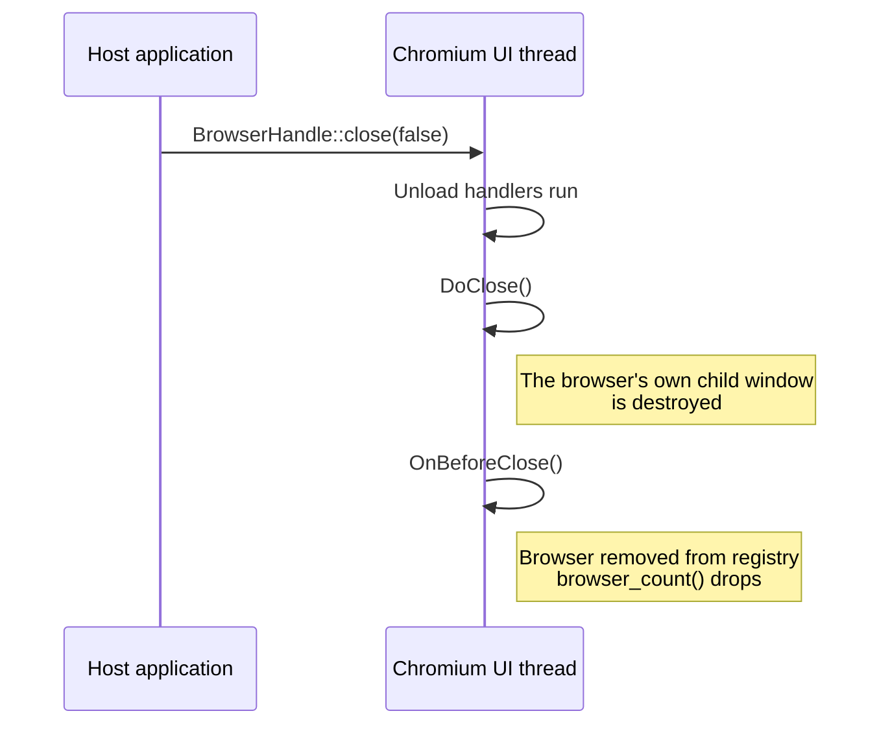
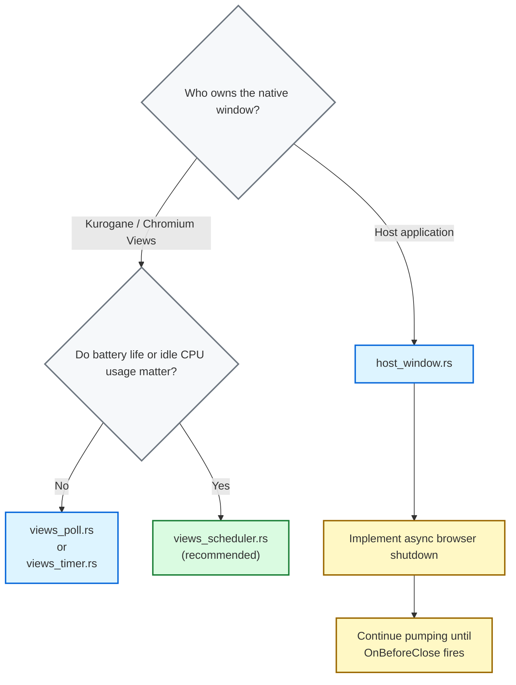

# Integration patterns for [`winit`](https://docs.rs/winit/latest/winit/)

Kurogane supports several event-loop integration strategies for embedding Chromium with [winit](https://docs.rs/winit/latest/winit/). They differ in how the host process drives the [Chromium message loop](https://chromiumembedded.github.io/cef/general_usage#message-loop-integration). That loop is how Chromium's internal scheduler dispatches I/O completions, IPC messages and renderer tasks on the browser process's main thread.

> **Threading model.** Chromium's browser-process main thread is a cooperative single-threaded executor. It has no background pump thread. The host process calls [`CefDoMessageLoopWork`](https://magpcss.org/ceforum/apidocs3/projects/(default)/(_globals).html#CefDoMessageLoopWork()) often enough that Chromium's internal timers and I/O completions are not starved. The strategies below differ only in *when* and *how often* the host calls it.

The examples are in [`kurogane-suite/winit`](../kurogane-suite/winit). Run one from `kurogane-suite`:

```bash
kurogane run --example winit_views_scheduler
```

The others are `winit_views_poll`, `winit_views_timer` and `winit_native_embedding`.

## Strategy comparison

| Example | [`ControlFlow`](https://docs.rs/winit/latest/winit/event_loop/enum.ControlFlow.html) mode | Pump cadence | Longest sleep | Complexity | When to use |
|---|---|---|---|---|---|
| [`views_poll.rs`](../kurogane-suite/winit/views_poll.rs) | `Poll` | Every loop iteration | None | Trivial | Quick debugging and experiments |
| [`views_timer.rs`](../kurogane-suite/winit/views_timer.rs) | `WaitUntil` | Fixed 16 ms interval | 16 ms | Low | Simple integrations without proxies |
| [`views_scheduler.rs`](../kurogane-suite/winit/views_scheduler.rs) | `WaitUntil` + wakeup | At the deadline Chromium asks for | 33 ms | Medium | Standard production apps (Views windows) |
| [`host_window.rs`](../kurogane-suite/winit/host_window.rs) | `WaitUntil` + wakeup | At the deadline Chromium asks for | 33 ms | Advanced | Custom windowing and embedding into existing UI |

> **Views vs. Embedded.** The first three examples use [Chromium's Views framework](https://github.com/chromiumembedded/cef/tree/master/include/views). There [`CefBrowserView`](https://magpcss.org/ceforum/apidocs3/projects/(default)/CefBrowserView.html) owns the native window. The host-managed embedding example ([`host_window.rs`](../kurogane-suite/winit/host_window.rs)) inverts this. The host creates the native window with [`winit`](https://docs.rs/winit/latest/winit/) and attaches Chromium as a child-window browser through [`CefWindowInfo::SetAsChild`](https://magpcss.org/ceforum/apidocs3/projects/(default)/CefWindowInfo.html). The event loop and window lifecycle differ a lot between the two modes (see the embedding section below).

## Continuous polling loop _(aka the Brute-forcer)_

The smallest integration that works. On every `winit` event-loop iteration the host calls Kurogane's [`AppInstance::pump`](../kurogane/src/runtime.rs). That calls [`CefDoMessageLoopWork`](https://magpcss.org/ceforum/apidocs3/projects/(default)/(_globals).html#CefDoMessageLoopWork()). The loop then schedules the next iteration at once.

```rust
struct ViewsDriver {
    handle: AppInstance,
}

impl ApplicationHandler for ViewsDriver {
    fn resumed(&mut self, _: &ActiveEventLoop) {}

    fn window_event(&mut self, _: &ActiveEventLoop, _: WindowId, _: WindowEvent) {}

    fn about_to_wait(&mut self, event_loop: &ActiveEventLoop) {
        self.handle.pump();

        // Exit after all Chromium Views windows have been closed
        if self.handle.should_shutdown() {
            event_loop.exit();
        }
    }
}

let handle = App::url("https://example.com").start()?;

let event_loop = EventLoop::new()?;
event_loop.set_control_flow(ControlFlow::Poll);
event_loop.run_app(&mut ViewsDriver { handle })?;
```

* **Cadence:** [`ControlFlow::Poll`](https://docs.rs/winit/latest/winit/event_loop/enum.ControlFlow.html#variant.Poll) runs every iteration. Kurogane is pumped without pause at an unbounded rate.
* **CPU profile:** The highest idle CPU use because the loop never sleeps. The documentation of [`CefDoMessageLoopWork`](https://magpcss.org/ceforum/apidocs3/projects/(default)/(_globals).html#CefDoMessageLoopWork()) asks a host that calls it to balance performance against excessive CPU use.
* **Complexity:** No scheduler is given. CEF runs without its external message pump and Kurogane's `App::scheduler` callback is never called.

**Use when:** you want the least code for throwaway testing or debugging and performance is not the point.

## Fixed-interval timer loop _(aka the Clockwatcher)_

A fixed-interval pump with winit's [`ControlFlow::WaitUntil`](https://docs.rs/winit/latest/winit/event_loop/enum.ControlFlow.html#variant.WaitUntil). The host wakes every 16 ms (about 60 Hz) and calls Kurogane's [`AppInstance::pump`](../kurogane/src/runtime.rs). That matches a simple `SetTimer` integration common in older Win32 Chromium hosts.

```rust
const PUMP_INTERVAL: Duration = Duration::from_millis(16);

fn about_to_wait(&mut self, event_loop: &ActiveEventLoop) {
    // Maintain a fixed pumping cadence independent of OS event frequency
    if Instant::now() >= self.next_pump {
        self.handle.pump();
        self.next_pump = Instant::now() + PUMP_INTERVAL;
    }

    if self.handle.should_shutdown() {
        event_loop.exit();
        return;
    }

    event_loop.set_control_flow(ControlFlow::WaitUntil(self.next_pump));
}
```

* **Cadence:** Driven by [`ControlFlow::WaitUntil`](https://docs.rs/winit/latest/winit/event_loop/enum.ControlFlow.html#variant.WaitUntil). Chromium is pumped at a fixed interval (about 60 Hz or 16 ms) apart from `winit`'s native input and window event rate.
* **CPU profile:** A low to moderate constant baseline. The runtime wakes and pumps even when the browser is fully idle.
* **Complexity:** Minimal. It bypasses [`CefBrowserProcessHandler::OnScheduleMessagePumpWork`](https://github.com/chromiumembedded/cef/blob/master/include/cef_browser_process_handler.h) and Kurogane's `App::scheduler`. The host sets the clock and not Chromium.
* **Tuning trade-off:** 16 ms is a reasonable default. A longer interval (100 ms for example) lowers CPU use further at the cost of visible jank in animated content.

**Use when:** you want a simple timer-driven integration and accept a small constant idle CPU cost. It suits tools and utilities where exact animation timing is not a priority.

## Reactive event-driven loop _(aka the Caped crusader)_

The recommended integration for Views-mode applications. The host registers a scheduler callback with Kurogane's `App::scheduler` instead of a fixed timer. CEF calls it whenever work is scheduled for the browser process's UI thread. Each call carries a [`PumpRequest`](../kurogane/src/app.rs) of `Now` or `After(delay)`.

The host turns each request into a deadline with `PumpRequest::deadline`. It keeps the earliest deadline it has not pumped yet and sleeps with [`ControlFlow::WaitUntil`](https://docs.rs/winit/latest/winit/event_loop/enum.ControlFlow.html#variant.WaitUntil) until then. It never sleeps longer than 33 ms after the last pump. winit wakes for whichever comes first of a native OS event, a new request or the deadline.

```rust
// The longest the loop waits between pumps: cefclient's kMaxTimerDelay
const MAX_PUMP_DELAY: Duration = Duration::from_millis(1000 / 30);

struct ViewsDriver {
    handle: AppInstance,
    // The earliest deadline CEF asked for, and never later than
    // MAX_PUMP_DELAY after the last pump
    next_pump: Instant,
}

// Kurogane starts first; the scheduler reaches the event loop once it exists
let wake: Arc<OnceLock<EventLoopProxy<Instant>>> = Arc::default();

let handle = App::url("https://example.com")
    .scheduler({
        let wake = wake.clone();
        move |request: PumpRequest| {
            // CEF may call this from any thread
            if let Some(proxy) = wake.get() {
                let _ = proxy.send_event(request.deadline(Instant::now()));
            }
        }
    })
    .start()?;

let event_loop = EventLoop::<Instant>::with_user_event().build()?;
let _ = wake.set(event_loop.create_proxy());

// The first pump comes at once: requests made before the proxy was set went nowhere
event_loop.run_app(&mut ViewsDriver { handle, next_pump: Instant::now() })?;
```

```rust
impl ApplicationHandler<Instant> for ViewsDriver {
    fn user_event(&mut self, _: &ActiveEventLoop, deadline: Instant) {
        // Keep the earliest: pumping early is harmless, pumping late stalls Chromium
        self.next_pump = self.next_pump.min(deadline);
    }

    fn about_to_wait(&mut self, event_loop: &ActiveEventLoop) {
        let now = Instant::now();
        if now >= self.next_pump {
            // Until CEF asks for an earlier pump
            self.next_pump = now + MAX_PUMP_DELAY;
            self.handle.pump();
        }

        if self.handle.should_shutdown() {
            event_loop.exit();
            return;
        }

        event_loop.set_control_flow(ControlFlow::WaitUntil(self.next_pump));
    }

    // resumed and window_event as in the polling loop
}
```

* **Cadence:** Driven by [`CefBrowserProcessHandler::OnScheduleMessagePumpWork`](https://github.com/chromiumembedded/cef/blob/master/include/cef_browser_process_handler.h) through Kurogane's `App::scheduler`. The loop pumps once a deadline CEF asked for has passed and 33 ms after the last pump at the latest.
* **The earliest deadline wins:** CEF's header says a delayed request cancels the pending one. This loop pumps only in `about_to_wait`. Replacing the deadline could push back a `Now` it has not pumped yet. Keeping the earliest can only pump early. That does no harm.
* **At least every 33 ms:** CEF's header does not promise to ask again after every pump. Its sample application cefclient never waits longer than 1000/30 ms between pumps ([`kMaxTimerDelay`](https://github.com/chromiumembedded/cef/blob/master/tests/cefclient/browser/main_message_loop_external_pump.cc)). This loop does the same. Work CEF did not ask about again waits 33 ms at most.
* **CPU profile:** Low. The loop sleeps between the deadlines Chromium asks for and 33 ms at most. When Chromium asks for nothing it pumps about 30 times a second.
* **Active profile:** It follows Chromium. Busy or animated content is pumped as often as Chromium asks.
* **Threading contract:** Chromium may call Kurogane's `App::scheduler` callback from any thread. Crossing that boundary takes [`EventLoopProxy::send_event`](https://docs.rs/winit/latest/winit/event_loop/struct.EventLoopProxy.html) to wake the `winit` event loop safely.
* **Startup:** A scheduler turns on Chromium's external message pump. The application starts with `App::start` (or `App::start_embedded`) and pumps from its own loop. `App::run` refuses a scheduler because Chromium's own loop cannot run under an external pump. On Linux `pump()` also dispatches glib's default main context. Chromium reads its X11 and Wayland events there (input, a window's close and resizes). Nothing else runs that context under an external pump. The host's loop needs no glib of its own.
* **Startup order:** Kurogane starts before winit's event loop is built. On macOS it installs the `NSApplication` subclass CEF needs. That must happen before winit creates the application. The proxy exists only once the event loop does. The scheduler reads it through a `OnceLock`. The loop's first pump comes at once and covers requests made before.
* **macOS menus:** Kurogane installs the standard App, Edit and Window menus into an empty menu bar when it starts. A menu set before is kept. winit's event loop replaces them at launch with an App menu alone. That has no Edit menu and ⌘C, ⌘V and ⌘A reach no web view. Build the loop with `EventLoopBuilderExtMacOS::with_default_menu(false)` to keep Kurogane's menus as every example in [`kurogane-suite/winit`](../kurogane-suite/winit) does. Or install a menu of your own. Quit (⌘Q or the Dock's) closes Kurogane's browsers. The loop exits once `should_shutdown()` turns true.

**Use when:** building a production application where resource use, battery life and exact animation timing matter. This follows the external message pump design Chromium's own [documentation on external message pumps](https://chromiumembedded.github.io/cef/general_usage#message-loop-integration) recommends for host-managed event loops.

## Host-managed native window embedding _(aka the Mad scientist)_

The embedded integration inverts the Views ownership model. The host application creates a native OS window with winit. It then attaches a Chromium browser as a child window with [`CefWindowInfo::SetAsChild`](https://magpcss.org/ceforum/apidocs3/projects/(default)/CefWindowInfo.html). The host keeps complete ownership of the top-level window. It resizes and positions the child browser with `BrowserHandle::set_bounds`.

```rust
let handle = App::new("frontend")
    .scheduler(/* as in the reactive loop */)
    .start_embedded()?;

// CEF parents a child browser to an X11 window on Linux, so the loop asks
// winit for X11, under XWayland in a Wayland session
#[cfg(target_os = "linux")]
let event_loop = {
    use winit::platform::x11::EventLoopBuilderExtX11;
    EventLoop::<Instant>::with_user_event().with_x11().build()?
};
// On macOS the loop keeps Kurogane's App, Edit and Window menus
#[cfg(target_os = "macos")]
let event_loop = {
    use winit::platform::macos::EventLoopBuilderExtMacOS;
    EventLoop::<Instant>::with_user_event().with_default_menu(false).build()?
};
#[cfg(not(any(target_os = "linux", target_os = "macos")))]
let event_loop = EventLoop::<Instant>::with_user_event().build()?;
```

```rust
fn resumed(&mut self, event_loop: &ActiveEventLoop) {
    let window = event_loop.create_window(Window::default_attributes()).unwrap();

    // The window itself is the parent; Kurogane takes its HWND, NSView or X11
    // window and refuses a Wayland surface
    match self.handle.create_child_browser(&window, client_bounds(&window), "app://app/index.html") {
        Ok(browser) => self.browser = Some(browser),
        Err(e) => eprintln!("the browser could not be created:\n{e}"),
    }
    self.window = Some(window);
}
```

`client_bounds` is the window's client area in the units the layout contract below gives (see [`host_window.rs`](../kurogane-suite/winit/host_window.rs)).

* **Cadence and CPU:** As in the reactive event-driven loop. It pumps at the deadlines Chromium asks for through Kurogane's `App::scheduler` and at least every 33 ms.
* **Window hierarchy:** The host process owns the window hierarchy. Chromium renders into a raw child surface (`HWND`, `NSView` or X11 window) of the `winit` window's native handle.
* **Linux:** CEF takes an X11 window as the parent. The host window must be one. winit's `with_x11()` gives an X11 window. In a Wayland session that window runs under XWayland. A Wayland surface cannot be a parent and `create_child_browser` refuses it with `RuntimeError::UnsupportedParentWindow`. For the same reason Kurogane runs Chromium itself on X11 in an embedded application. In a Wayland session Chromium would pick Wayland and draw the page beside the host's window and not in it. `App::chromium_flag_with_value("ozone-platform", ..)` overrides this.
* **Layout contract:** Chromium places a child browser once at the bounds given to `create_child_browser`. On Windows and Linux it does not follow the host window. The host moves and resizes it with `BrowserHandle::set_bounds` whenever its place changes. A browser that fills the window needs it on every `WindowEvent::Resized`. CEF's own sample client does the same (`SetWindowPos` on Windows and `XMoveResizeWindow` on X11). On macOS Chromium stretches the browser with its parent view. `set_bounds` places it anywhere by setting the view's frame. Bounds are in the parent window's coordinates. They are pixels on Windows and X11 and points on macOS. On macOS winit's `inner_size()` is converted with `to_logical`. [`CefBrowserHost::WasResized`](https://magpcss.org/ceforum/apidocs3/projects/(default)/CefBrowserHost.html#WasResized()) does not apply. It is for windowless (off-screen) browsers only.

The host process owns the root window. Teardown is therefore a coordinated asynchronous dance across the host thread and the Chromium UI thread.

The host must not shut down Chromium globally until every browser has completed its close sequence.

### Asynchronous shutdown sequence

Shutting down an embedded browser takes coordination across the browser process UI thread and the renderer process. [`CefBrowserHost::CloseBrowser`](https://magpcss.org/ceforum/apidocs3/projects/(default)/CefBrowserHost.html#CloseBrowser(bool)) is only the first step.

#### Teardown state machine


#### Closing an embedded browser



Closing a browser never asks the host's window to close. The window stays open with any other browsers in it. The host decides when to close its window. It keeps pumping until `should_shutdown()` turns true once the last browser has closed. Then it calls `AppInstance::shutdown`.

Decouple the intent to close a window from leaving the event loop. Exit on `should_shutdown()` and not on a flag the host owns. The host window is not the only way the browsers can end. On macOS Quit closes them all without a `CloseRequested` event.

```rust
fn window_event(&mut self, _: &ActiveEventLoop, _: WindowId, event: WindowEvent) {
    if let WindowEvent::CloseRequested = event {
        // Do NOT exit the event loop here: ask the browsers to close and let
        // Chromium drive the shutdown sequence while the loop keeps pumping
        self.handle.handle().close_all_browsers(true);
    }
}

fn about_to_wait(&mut self, event_loop: &ActiveEventLoop) {
    // ... pump at the deadline, as in the reactive loop ...

    if self.handle.should_shutdown() {
        // All browsers have closed and the window can now be released
        self.window = None;
        self.handle.shutdown();
        event_loop.exit();
    }
}
```

**Use when:** you need Chromium as a composited component inside an existing application UI (a web-based settings panel inside a native game or tool window for example). It is the most flexible integration. The host must implement the asynchronous shutdown protocol end to end.

> **Fatal footgun:** Browser shutdown is asynchronous. `BrowserHandle::close` and `AppHandle::close_all_browsers` only *start* the teardown sequence. The browser is destroyed only when Chromium later dispatches [`OnBeforeClose`](https://magpcss.org/ceforum/apidocs3/projects/(default)/CefLifeSpanHandler.html#OnBeforeClose) *from within* Kurogane's [`AppInstance::pump`](../kurogane/src/runtime.rs). The browser then leaves the registry. Exit the event loop with [`event_loop.exit()`](https://docs.rs/winit/latest/winit/event_loop/struct.ActiveEventLoop.html#method.exit) or drop your window structures on `CloseRequested` and the host stops pumping Chromium. [`OnBeforeClose`](https://magpcss.org/ceforum/apidocs3/projects/(default)/CefLifeSpanHandler.html#OnBeforeClose) never runs and the close sequence never completes. `browser_count()` never reaches 0 and `should_shutdown()` never turns true.

## Choosing a strategy



## References

* [Chromium general usage](https://chromiumembedded.github.io/cef/general_usage): upstream architecture guide
* [LifeSpanHandler methods](https://magpcss.org/ceforum/apidocs3/projects/(default)/CefLifeSpanHandler.html): browser creation and destruction lifecycle
