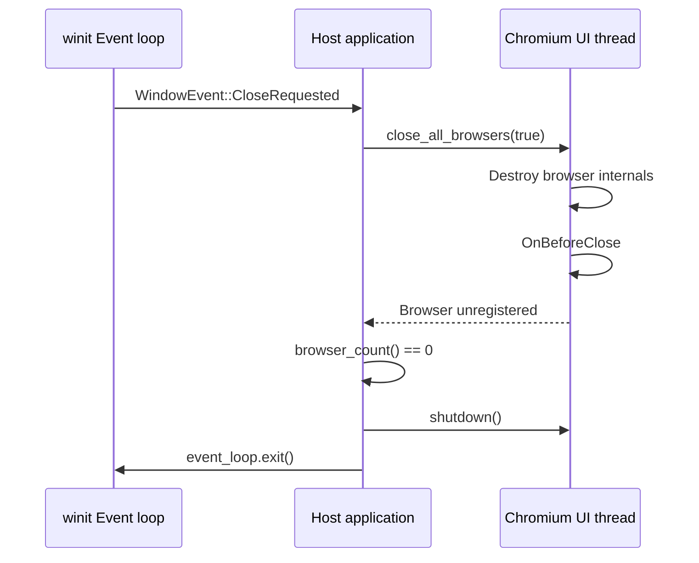
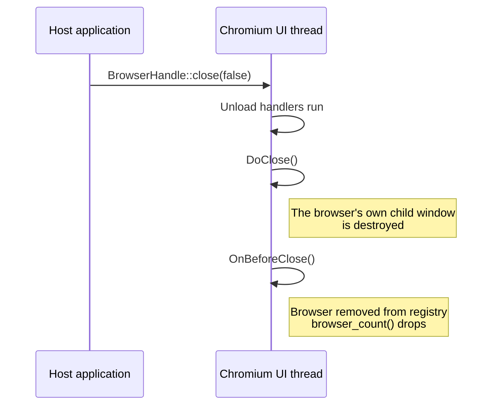
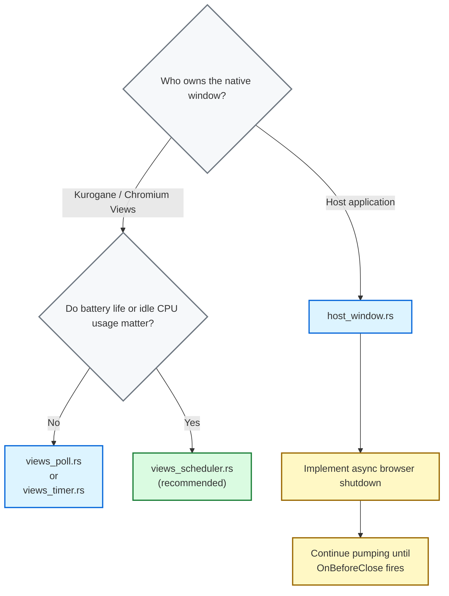

# Integration patterns for [`winit`](https://docs.rs/winit/latest/winit/)

Kurogane supports multiple event-loop integration strategies when embedding Chromium via [winit](https://docs.rs/winit/latest/winit/). Each strategy differs in how the host process drives the [Chromium message loop](https://chromiumembedded.github.io/cef/general_usage#message-loop-integration), the mechanism by which Chromium's internal scheduler dispatches I/O completions, IPC messages and renderer tasks on the browser process's main thread.

> **Threading model.** Chromium's browser-process main thread is a cooperative, single-threaded executor. It does not use a background pump thread. The host process is responsible for calling [`CefDoMessageLoopWork`](https://magpcss.org/ceforum/apidocs3/projects/(default)/(_globals).html#CefDoMessageLoopWork()) frequently enough that Chromium's internal timers and I/O completions are not starved. The strategies below differ only in *when* and *how often* the host elects to call this function.

The examples are in [`kurogane-suite/winit`](../kurogane-suite/winit). Run one from `kurogane-suite` with `kurogane run --example winit_views_scheduler` (or `winit_views_poll`, `winit_views_timer`, `winit_native_embedding`).

## Strategy Comparison

| Example | [`ControlFlow`](https://docs.rs/winit/latest/winit/event_loop/enum.ControlFlow.html) mode | Pump cadence | Longest sleep | Complexity | When to use |
|---|---|---|---|---|---|
| [`views_poll.rs`](../kurogane-suite/winit/views_poll.rs) | `Poll` | Every loop iteration | None | Trivial | Quick debugging / experimentation |
| [`views_timer.rs`](../kurogane-suite/winit/views_timer.rs) | `WaitUntil` | Fixed 16 ms interval | 16 ms | Low | Simple integrations without proxies |
| [`views_scheduler.rs`](../kurogane-suite/winit/views_scheduler.rs) | `WaitUntil` + wakeup | At the deadline Chromium asks for | 33 ms | Medium | Standard production apps (Chromium Windows) |
| [`host_window.rs`](../kurogane-suite/winit/host_window.rs) | `WaitUntil` + wakeup | At the deadline Chromium asks for | 33 ms | Advanced | Custom windowing / embedding into existing UI |

> **Views vs. Embedded.** The first three examples use [Chromium's Views framework](https://github.com/chromiumembedded/cef/tree/master/include/views), where [`CefBrowserView`](https://magpcss.org/ceforum/apidocs3/projects/(default)/CefBrowserView.html) owns the native window. Host-managed native window embedding example ([`host_window.rs`](../kurogane-suite/winit/host_window.rs)) inverts this: the host creates the native window via [`winit`](https://docs.rs/winit/latest/winit/) and attaches Chromium as a child-window browser via [`CefWindowInfo::SetAsChild`](https://magpcss.org/ceforum/apidocs3/projects/(default)/CefWindowInfo.html). The event loop and window lifecycle management differs significantly between these two modes; see the native embedded integrator for details.

## Continuous polling loop _(aka the Brute-forcer)_

The minimal-viable integration. On every `winit` event-loop iteration, the host calls Kurogane's [`AppInstance::pump`](../kurogane/src/runtime.rs), which in turn calls [`CefDoMessageLoopWork`](https://magpcss.org/ceforum/apidocs3/projects/(default)/(_globals).html#CefDoMessageLoopWork()), then immediately schedules the next iteration.

```rust
struct ViewsDriver {
    handle: AppInstance,
}

impl ApplicationHandler for ViewsDriver {
    fn resumed(&mut self, _: &ActiveEventLoop) {}

    fn window_event(&mut self, _: &ActiveEventLoop, _: WindowId, _: WindowEvent) {}

    fn about_to_wait(&mut self, event_loop: &ActiveEventLoop) {
        self.handle.pump();

        // Exit after all Chromium Views windows have been closed
        if self.handle.should_shutdown() {
            event_loop.exit();
        }
    }
}

let handle = App::url("https://example.com").start()?;

let event_loop = EventLoop::new()?;
event_loop.set_control_flow(ControlFlow::Poll);
event_loop.run_app(&mut ViewsDriver { handle })?;
```

* **Cadence:** [`ControlFlow::Poll`](https://docs.rs/winit/latest/winit/event_loop/enum.ControlFlow.html#variant.Poll) executes every iteration. Kurogane is pumped continuously at an unbounded rate.
* **CPU profile:** Highest idle CPU usage: the loop never sleeps. The documentation of [`CefDoMessageLoopWork`](https://magpcss.org/ceforum/apidocs3/projects/(default)/(_globals).html#CefDoMessageLoopWork()) asks a host that calls it to balance performance against excessive CPU usage.
* **Complexity:** No scheduler is given, so CEF runs without its external message pump and Kurogane's `App::scheduler` callback is not invoked.

**Use when:** you want the minimum amount of code needed for disposable testing or debugging where performance profiling is not the objective.

## Fixed-interval timer loop _(aka the Clockwatcher)_

A fixed-interval pump using winit's [`ControlFlow::WaitUntil`](https://docs.rs/winit/latest/winit/event_loop/enum.ControlFlow.html#variant.WaitUntil). The host wakes every 16 ms (~60 Hz) and calls Kurogane's [`AppInstance::pump`](../kurogane/src/runtime.rs), approximating the behaviour of a naive `SetTimer`-based integration common in legacy Win32 Chromium hosts.

```rust
const PUMP_INTERVAL: Duration = Duration::from_millis(16);

fn about_to_wait(&mut self, event_loop: &ActiveEventLoop) {
    // Maintain a fixed pumping cadence independent of OS event frequency
    if Instant::now() >= self.next_pump {
        self.handle.pump();
        self.next_pump = Instant::now() + PUMP_INTERVAL;
    }

    if self.handle.should_shutdown() {
        event_loop.exit();
        return;
    }

    event_loop.set_control_flow(ControlFlow::WaitUntil(self.next_pump));
}
```

* **Cadence:** Driven by [`ControlFlow::WaitUntil`](https://docs.rs/winit/latest/winit/event_loop/enum.ControlFlow.html#variant.WaitUntil). Chromium is pumped at a fixed interval (~60Hz / 16ms), decoupled from `winit`'s native input/window event rate.
* **CPU profile:** Low-to-moderate constant baseline overhead. The runtime wakes and pumps even when the browser state is fully quiescent.
* **Complexity:** Minimal. Bypasses [`CefBrowserProcessHandler::OnScheduleMessagePumpWork`](https://github.com/chromiumembedded/cef/blob/master/include/cef_browser_process_handler.h) / Kurogane's `App::scheduler`. The host dictates the clock, not Chromium.
* **Tuning trade-off:** 16 ms is a reasonable default. Increasing the interval (e.g., 100ms) drops CPU overhead further at the cost of perceptible jank in animated content.

**Use when:** you want a simple, timer-driven integration and are comfortable with a small constant idle-CPU cost. Appropriate for tools and utilities where absolute animation fidelity isn't a priority.

## Reactive event-driven loop _(aka the Caped crusader)_

The recommended integration for Views-mode deployments. Instead of a fixed timer, the host registers a scheduler callback via Kurogane's `App::scheduler`. CEF calls it whenever work has been scheduled for the browser process's UI thread, with a [`PumpRequest`](../kurogane/src/app.rs): `Now`, or `After(delay)`. The host turns each request into a deadline with `PumpRequest::deadline`, keeps the earliest one it has not pumped yet, and sleeps with [`ControlFlow::WaitUntil`](https://docs.rs/winit/latest/winit/event_loop/enum.ControlFlow.html#variant.WaitUntil) until then, but never longer than 33 ms after the last pump. winit wakes for a native OS event, a new request or the deadline, whichever comes first.

```rust
// The longest the loop waits between pumps: cefclient's kMaxTimerDelay
const MAX_PUMP_DELAY: Duration = Duration::from_millis(1000 / 30);

struct ViewsDriver {
    handle: AppInstance,
    // The earliest deadline CEF asked for, and never later than
    // MAX_PUMP_DELAY after the last pump
    next_pump: Instant,
}

// Kurogane starts first; the scheduler reaches the event loop once it exists
let wake: Arc<OnceLock<EventLoopProxy<Instant>>> = Arc::default();

let handle = App::url("https://example.com")
    .scheduler({
        let wake = wake.clone();
        move |request: PumpRequest| {
            // CEF may call this from any thread
            if let Some(proxy) = wake.get() {
                let _ = proxy.send_event(request.deadline(Instant::now()));
            }
        }
    })
    .start()?;

let event_loop = EventLoop::<Instant>::with_user_event().build()?;
let _ = wake.set(event_loop.create_proxy());

// The first pump comes at once: requests made before the proxy was set went nowhere
event_loop.run_app(&mut ViewsDriver { handle, next_pump: Instant::now() })?;
```

```rust
impl ApplicationHandler<Instant> for ViewsDriver {
    fn user_event(&mut self, _: &ActiveEventLoop, deadline: Instant) {
        // Keep the earliest: pumping early is harmless, pumping late stalls Chromium
        self.next_pump = self.next_pump.min(deadline);
    }

    fn about_to_wait(&mut self, event_loop: &ActiveEventLoop) {
        let now = Instant::now();
        if now >= self.next_pump {
            // Until CEF asks for an earlier pump
            self.next_pump = now + MAX_PUMP_DELAY;
            self.handle.pump();
        }

        if self.handle.should_shutdown() {
            event_loop.exit();
            return;
        }

        event_loop.set_control_flow(ControlFlow::WaitUntil(self.next_pump));
    }

    // resumed and window_event as in the polling loop
}
```

* **Cadence:** Driven by [`CefBrowserProcessHandler::OnScheduleMessagePumpWork`](https://github.com/chromiumembedded/cef/blob/master/include/cef_browser_process_handler.h) via Kurogane's `App::scheduler`. The loop pumps once a deadline CEF asked for has passed, and 33 ms after the last pump at the latest.
* **The earliest deadline wins:** CEF's header says a delayed request cancels the one pending. This loop pumps only in `about_to_wait`, so replacing the deadline could push back a `Now` it has not pumped yet; keeping the earliest can only pump early, which does no harm.
* **At least every 33 ms:** CEF's header does not say that it asks again after every pump. Its sample application, cefclient, never waits longer than 1000/30 ms between pumps ([`kMaxTimerDelay`](https://github.com/chromiumembedded/cef/blob/master/tests/cefclient/browser/main_message_loop_external_pump.cc)). This loop does the same, so work CEF did not ask about again waits 33 ms at most.
* **CPU profile:** Low. The loop sleeps between the deadlines Chromium asks for, 33 ms at most; when Chromium asks for nothing it pumps about 30 times a second.
* **Active profile:** Follows Chromium: busy or animated content is pumped as often as Chromium asks.
* **Threading Contract:** Chromium may call Kurogane's `App::scheduler` callback from any thread. Crossing this boundary requires [`EventLoopProxy::send_event`](https://docs.rs/winit/latest/winit/event_loop/struct.EventLoopProxy.html) to thread-safely wake the `winit` event loop.
* **Startup:** a scheduler turns on Chromium's external message pump, so the application starts with `App::start` (or `App::start_embedded`) and pumps from its own loop. `App::run` refuses one: Chromium's own loop cannot run under an external pump.
* **Startup order:** Kurogane starts before winit's event loop is built: on macOS it installs the `NSApplication` subclass CEF needs, which must happen before winit creates the application. The proxy exists only once the event loop does, so the scheduler reads it through a `OnceLock`, and the loop's first pump, at once, covers requests made before.

**Use when:** building a production application where resource optimization, battery life and frame-accurate animation fidelity are critical. This follows the external-message-pump architecture recommended for host-managed event loops in Chromium's own [documentation on external message pumps](https://chromiumembedded.github.io/cef/general_usage#message-loop-integration).

## Host-managed native window embedding _(aka the Mad scientist)_

The embedded integration inverts the Views ownership model. The host application creates a native OS window via winit, then attaches a Chromium browser as a child window using [`CefWindowInfo::SetAsChild`](https://magpcss.org/ceforum/apidocs3/projects/(default)/CefWindowInfo.html). The host retains complete ownership of the top-level window and is responsible for resizing and positioning the child browser surface, with `BrowserHandle::set_bounds`.

```rust
let handle = App::new("frontend")
    .scheduler(/* as in the reactive loop */)
    .start_embedded()?;

// CEF parents a child browser to an X11 window on Linux, so the loop asks
// winit for X11, under XWayland in a Wayland session
#[cfg(target_os = "linux")]
let event_loop = {
    use winit::platform::x11::EventLoopBuilderExtX11;
    EventLoop::<Instant>::with_user_event().with_x11().build()?
};
#[cfg(not(target_os = "linux"))]
let event_loop = EventLoop::<Instant>::with_user_event().build()?;
```

```rust
fn resumed(&mut self, event_loop: &ActiveEventLoop) {
    let window = event_loop.create_window(Window::default_attributes()).unwrap();

    // None if CEF could not create the browser
    self.browser = self.handle.create_child_browser(
        native_handle(&window),
        client_bounds(&window),
        "app://app/index.html",
    );
    self.window = Some(window);
}

/// The parent window CEF takes: an HWND on Windows, an NSView on macOS, an
/// X11 window on Linux
fn native_handle(window: &Window) -> *mut c_void {
    match window.window_handle().unwrap().as_raw() {
        #[cfg(target_os = "windows")]
        RawWindowHandle::Win32(h) => h.hwnd.get() as *mut c_void,
        #[cfg(target_os = "macos")]
        RawWindowHandle::AppKit(h) => h.ns_view.as_ptr(),
        #[cfg(target_os = "linux")]
        RawWindowHandle::Xlib(h) => h.window as usize as *mut c_void,
        _ => panic!("unsupported platform"),
    }
}
```

`client_bounds` is the window's client area in the units the layout contract below gives, as in [`host_window.rs`](../kurogane-suite/winit/host_window.rs).

- **Cadence & CPU:** As in the reactive event-driven loop: at the deadlines Chromium asks for through Kurogane's `App::scheduler`, and at least every 33 ms.
- **Window hierarchy:** The host process owns the window hierarchy. Chromium renders into a raw child surface (`HWND` / `NSView` / X11 window) of the `winit` window's native handle.
- **Linux:** CEF takes an X11 window as the parent, so the host window must be one: winit's `with_x11()` gives an X11 window, under XWayland in a Wayland session. A Wayland surface cannot be a parent. Embedding is incomplete on Linux today: `set_bounds` has no effect there, and an embedded browser's close does not complete.
- **Layout contract:** Chromium places a child browser once, at the bounds given to `create_child_browser`. On Windows and Linux it does not follow the host window: the host moves and resizes it with `BrowserHandle::set_bounds` whenever its place changes, on every `WindowEvent::Resized` for a browser that fills the window, as CEF's own sample client does (`SetWindowPos` on Windows, `XMoveResizeWindow` on X11). On macOS Chromium stretches the browser with its parent view, and `set_bounds` places it anywhere by setting the view's frame. Bounds are in the parent window's coordinates: pixels on Windows and X11, points on macOS, where winit's `inner_size()` is converted with `to_logical`. [`CefBrowserHost::WasResized`](https://magpcss.org/ceforum/apidocs3/projects/(default)/CefBrowserHost.html#WasResized()) does not apply: it is for windowless (off-screen) browsers only.

Because the host process owns the root window, teardown requires a coordinated multi-step asynchronous dance across the host thread and Chromium UI thread.

The host must not invoke global Chromium shutdown until all browsers have completed their close sequence.

### Asynchronous shutdown sequence

The shutdown sequence for an embedded browser involves coordination across the browser process UI thread and the renderer process. Initiating shutdown with [`CefBrowserHost::CloseBrowser`](https://magpcss.org/ceforum/apidocs3/projects/(default)/CefBrowserHost.html#CloseBrowser(bool)) is only the first step.

#### Teardown state machine



#### Closing an embedded browser



Closing a browser never asks the host's window to close. The window stays open, with any other browsers in it. The host decides when to close its window and keeps pumping until `browser_count()` is 0 before it calls `AppInstance::shutdown`.

The correct pattern is to decouple window-close intent from event-loop exit:

```rust
fn window_event(&mut self, _: &ActiveEventLoop, _: WindowId, event: WindowEvent) {
    if let WindowEvent::CloseRequested = event {
        // Do NOT exit the event loop here: ask the browsers to close and let
        // Chromium drive the shutdown sequence while the loop keeps pumping
        self.closing = true;
        self.handle.handle().close_all_browsers(true);
    }
}

fn about_to_wait(&mut self, event_loop: &ActiveEventLoop) {
    // ... pump at the deadline, as in the reactive loop ...

    if self.closing && self.handle.handle().browser_count() == 0 {
        // OnBeforeClose has run for every browser: now the window can go
        self.window = None;
        self.handle.shutdown();
        event_loop.exit();
    }
}
```

**Use when:** you need Chromium as a composited component within an existing application UI e.g., rendering a web-based settings panel inside a native game or tool window. This is the most flexible integration but requires the host to correctly implement the asynchronous shutdown protocol end-to-end.

> **Fatal footgun:** Browser shutdown is asynchronous. `BrowserHandle::close` and `AppHandle::close_all_browsers` only *initiate* the teardown sequence. The browser is not actually destroyed until Chromium later dispatches [`OnBeforeClose`](https://magpcss.org/ceforum/apidocs3/projects/(default)/CefLifeSpanHandler.html#OnBeforeClose) *from within* Kurogane's [`AppInstance::pump`](../kurogane/src/runtime.rs) (which internally executes [`CefDoMessageLoopWork`](https://magpcss.org/ceforum/apidocs3/projects/(default)/(_globals).html#CefDoMessageLoopWork())), after which the browser is removed from the registry. If you intercept a `CloseRequested` window event and immediately call [`event_loop.exit()`](https://docs.rs/winit/latest/winit/event_loop/struct.ActiveEventLoop.html#method.exit) or drop your window structures, the host stops pumping Chromium, [`OnBeforeClose`](https://magpcss.org/ceforum/apidocs3/projects/(default)/CefLifeSpanHandler.html#OnBeforeClose) never executes and the close sequence cannot complete (`browser_count()` never reaches 0 and `should_shutdown()` never turns true).

## Choosing a strategy



## References

- [Chromium general usage](https://chromiumembedded.github.io/cef/general_usage): Upstream architecture guide
- [LifeSpanHandler methods](https://magpcss.org/ceforum/apidocs3/projects/(default)/CefLifeSpanHandler.html): Browser creation and destruction lifecycle
